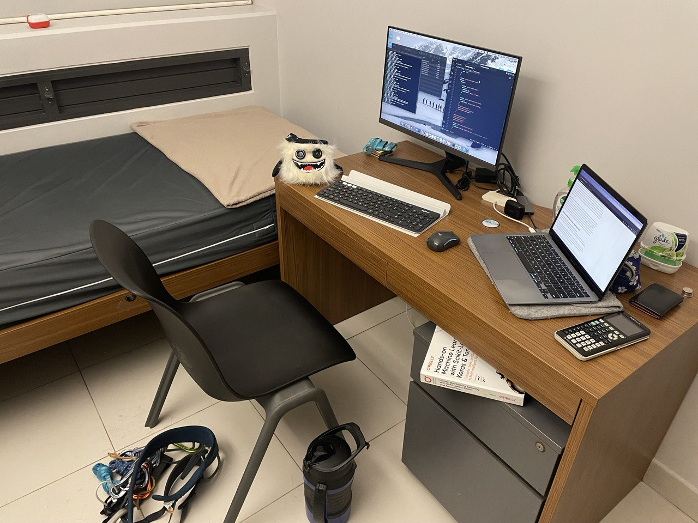

## A New Semester

Again, it's 3am into the night. I should really be clearing some backlog, but we don't always make the best decisions, so September's piece came early. Not a bad idea actually, I can foresee September is going to be a really, really busy month. It's peak period for interviews and technical assessments, school work will start ramping up, and perhaps most problematic of all, my reluctance to give up on playtime.

## Academia
It's no secret among those who know me that I am a bit of a nerd (maybe more than a bit..). I like learning new concepts and exploring different ideas, in Computer Science and Math, even though i'm not a particularly fast learner. But that doesn't deter me from yet again taking a full coursework of math and cs modules while trying to pull my CAP (GPA equivalent) up. *Talk about shooting oneself in the foot lol*. Still, it doesn't end there. During summer, I embarked on two research projects in Machine Learning to further improve myself. Things have gotten much more interesting in recent weeks and i've decided to continue my efforts in these areas throughout the semester, hopeful it culminates into well-received publications.

## Wait.. There's More?
The problem with the schedule lies in the planner. Sure, I like to study but boy do I like my playtime as well. You might be wondering what I meant by playtime, don't worry it's nothing philandering, I just meant time spent climbing and hanging out with friends from school clubs and outside of clubs. I'm part of both Climbing and Mountaineering club, so I spend my nights either climbing or running up and down hills. Naturally, I wouldn't be going for every session, but i'm typically in-charge for wall related matters, and since both clubs are home to climbers, it's 2-birds-with-1-stone. What i've realised is that I really enjoy spending time and interacting with people during these leisure climbs. Some are extremely passionate climbers looking to further challenge themselves, some are beginners with their new-found love for climbing, and others who still climb, but mostly drop by for a chit-chat session. *It's a good vibe*.

## It's Not All Play!
Climbing has garnered much attention in recent years and its evident that there is a strong demand for it in school as well. Climbing Club never has to worry about a lack of registration. But an issue remains - there's no avenue for outdoor climbs. In Singapore, we mostly climb indoors (Dairy farm.. T_T) but at some point in a climber's journey, his itchy hands and wandering mind will direct him to the natural world. Most outdoor climbing trips are exclusively hosted for a select group of friends, and rightfully so. The barrier to entry is rather high, and you wouldn't want to start climbing outdoors by yourself with no experience whatsoever. Even for those who are experienced with indoor climbing, outdoor climbing is an altogether different beast. The risk is high but can be mitigated if assisted by the right hands. That said, no experienced climbers would want to travel out of Singapore just to be a 'belay slave' (a term used to describe climbers who end up tending to beginners and having to belay them rather than being able to focus on their own climbs). Hence, the outdoor climbing scene hasn't grown much even though the demand is high.  

**So that's where I step in!** A friend of mine from Mountaineering Club is really passionate about climbing. He's one of the more 'friendly' climbers around, who isn't just solely interested in his own self-progression, but also seeking to spread the love of climbing to the rest of the NUS community. Specifically, he wishes to make outdoor climbing accessible to many more, even beginners who simply seek the thrill of the sport. A commendable objective! And that's where I realised too, that I am in the perfect position to share and execute his vision! My involvement in both the school's Climbing and Mountaineering clubs might help to bring any talks of collaboration to fruition. So we sprung into action. Now, we are deep in the midst of planning our very first pilot trial of bringing climbers to Batu Caves in Malaysia, as early as September.

## I Shall Look Back One Day And Smile
**Exciting? *Definitely*. Ambitious? *Indeed*. Audacious? *Perhaps***.  
*Romanticsm tells us that in order to make the most of our human potential, we must have as many different experiences as we can.* I'm quite the pragmatist, but in this regard, i'm every bit the **romanticist**.

So, these are what will keep me really busy this semester. To cope with my heavy involvement in school work and club activities, i've finally (after 2 years of staying off-campus) decided it would be best to make NUS my home of the 3 next months. Hopefully my trusty Mac alongside the life-saving monitor, handy chalkbag, and smelly harness will tide me through the storms to come 🫠.

P.S. Title was inspired by a quote by Michael from The Good Place. It was enjoyable and was one of the few series I stuck with till the end. 
