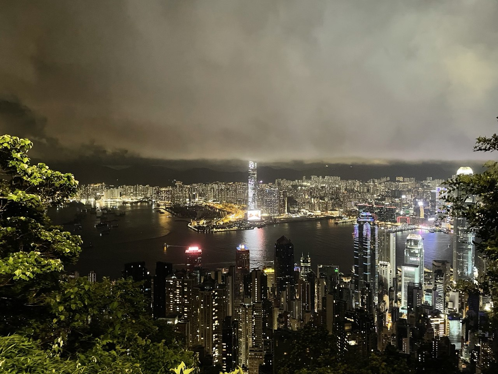
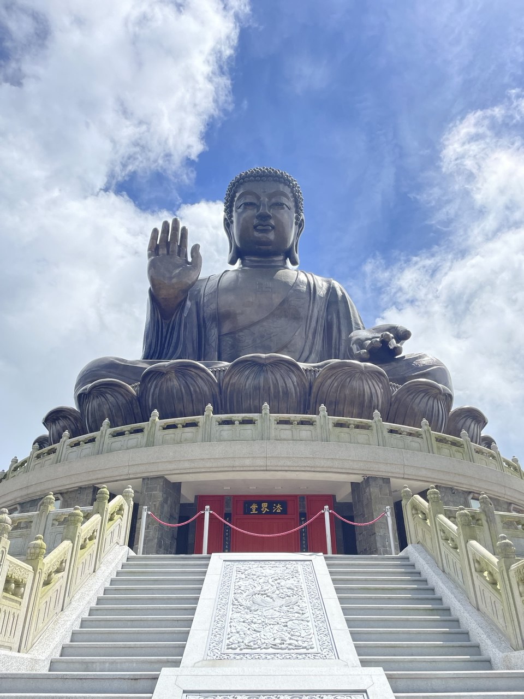
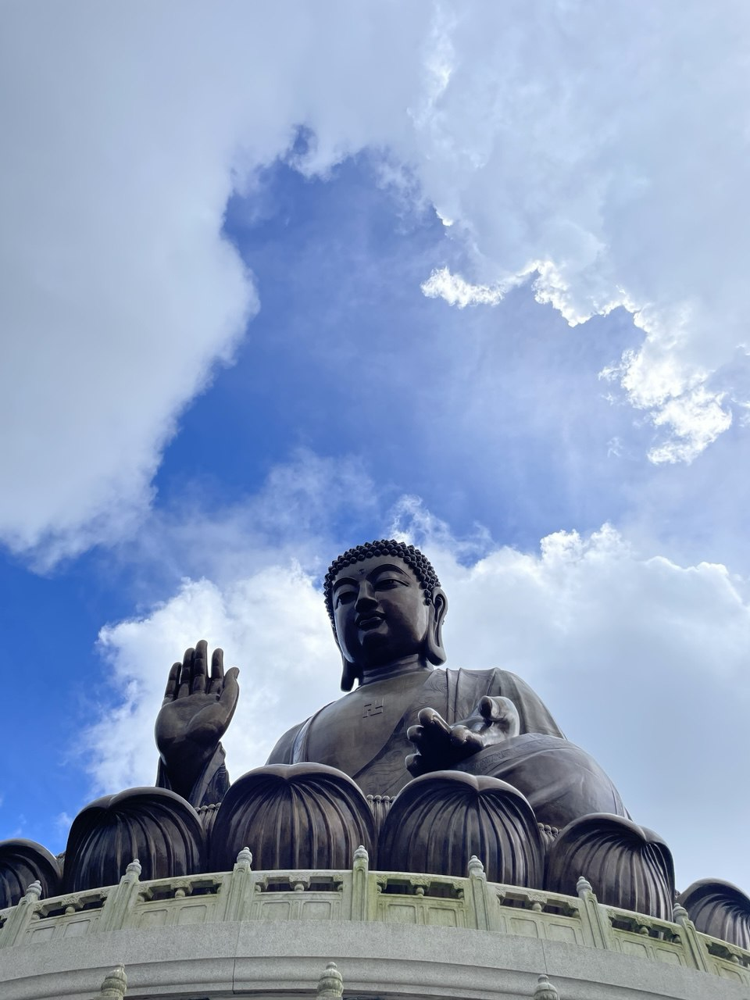
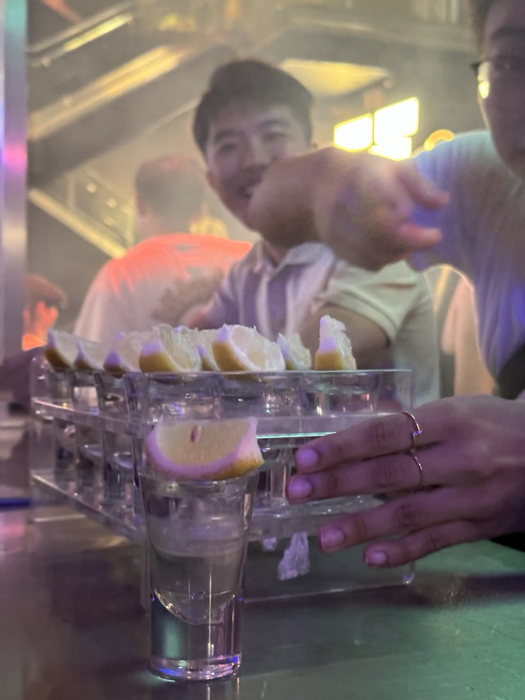
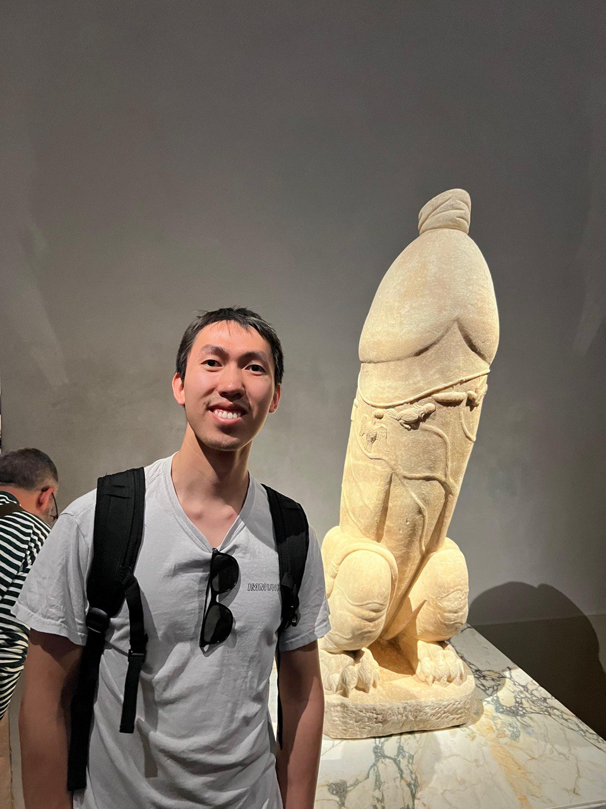
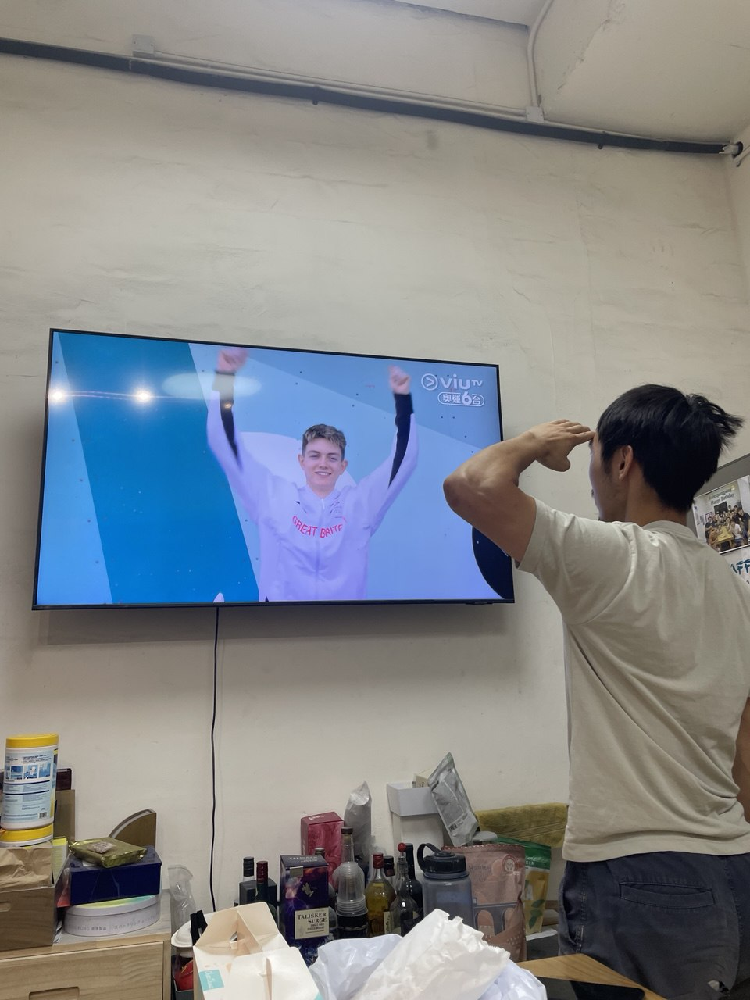

Okay.. the description was admittedly dramatic. Just click-bait. Not all was bad, of course. But Hong Kong does remind me of an alternate Singapore — similar in so many ways but I am often reminded this isn't home. And as a true blue Singaporean, naturally I would diss a little on my lovable sunny island, and by extension, its twin.

<figure style="margin: 0 auto;">
  
  <figcaption><em>Skyline from Victoria Peak.</em></figcaption>
</figure>

 

## The Parallels, and the Cracks
You see many similarities between Hong Kong and Singapore. Both tiny city-states (debatable for HK..). Both densely packed. Both financial hubs. Late-night diners are a common sight for those on OT. People are always rushing — eating, driving, honking (i'd say as angsty as Singaporean drivers), and generally moving with urgency.

Even the metro system feels familiar, right down to the colour schemes. And yet, every now and then, you’re reminded things aren’t quite the same. In Singapore, we have the MRT; here, it’s the MTR. Here, people speak Cantonese, and maybe it’s the dialect, but it often comes across more abrasive than Mandarin (or maybe Singlish softens our tone and makes us feel warmer).
 
Food prices are roughly similar, though portions here tend to be more generous. I’ve never received a full-moon slice of luncheon meat in Singapore, but that seems to be the norm here. In Singapore, we keep left when walking. Here, the default is the right.

I also noticed that Hong Kong feels like a more extreme version of Singapore’s inequality gap. Older areas like Kowloon, Sham Shui Po, Mong Kok  have fuzzy streets littered with trash, cockroaches running amok, stalls and picnic mats propped up wherever space permits. Tight, messy, compact. Just really chaotic.

This stands in stark contrast to Hong Kong Island. Clean, immaculate, and almost surgical. Walking through Causeway Bay and Wan Chai, I couldn’t believe how pristine everything looked. It felt as though the city had quietly given up on its older parts and poured all its resources into the new.

And i'm not sure why but I sensed a certain dread in people’s eyes. At least in Singapore, you still hear people complain, for example the loud minority on Reddit. Here, people seem quieter. Less inclined to talk, less inclined to complain (except when rushing you out during lunch hour). Just trudging along.

 

## Life at Hong Kong

### Work
I was glad to have landed an internship, an ML one, no less. A good learning opportunity. My accommodation was about an hour away from the office, which wasn’t ideal, but it did help me develop a reading habit.

Work itself was engaging. I gained experience with foundational ML tools like PyTorch and TensorFlow, got exposure to production environments, and worked on quantitative statistical modelling projects affiliated with HFT firms (though sadly, not paid HFT money). Still, compensation was  very decent, despite being a research institute.

My direct supervisor was a lauded mathematics PhD. His projects, and by extension, mine, focused on statistical modelling for time series analysis (and hence, the quant), as well as hologram-building via neural networks (the latter being his side project).

It was probably through him that I first noticed the jadedness of Hong Kong life. He was reserved. And a clear workaholic. He’d finish lunch in 15 minutes, spend 30 minutes playing Genshin Impact, then take a strict 45 minutes nap with his sleep headgear on. During which I was reminded under no circumstances should I disturb him. When did he leave the office? I have no idea. I never saw him leave before 7pm.

## Play
In my free time, I either went bouldering, hiking, or visited landmarks around Hong Kong. Here are some shots from a hike to see the Big Buddha. You could take a bus and cable car up, but I opted for a six-hour hike to give the journey meaning, turning it into some sort of pilgrimage. The heat nearly killed me though.

  <figure style="margin: 0; text-align: center; flex: 1;">
    
  </figure>
  <figure style="margin: 0; text-align: center; flex: 1;">
    
  </figure>

  <figure style="margin: 0; text-align: center; flex: 1;">
    
  </figure>
  <figure style="margin: 0; text-align: center; flex: 1;">
    
  </figure>

 

I also visited Ocean Park’s Water World. The rides were fun. I even witnessed a lonely male walrus doing.. well.. what any lonely male does to gratify himself. (I wouldn't believe what im insinuating either, had I not capture it on video.)

    

 

I wandered night streets too. Hong Kong’s nightlife is undeniably alive.

 

## The Two Kinds of People You'll Meet Here
My earlier depiction of Hong Kongers isn’t entirely fair, at least not to a certain group of young, ambitious people. As a financial hub, the city attracts aspiring financiers, lawyers, and twenty-year-olds brimming with bravado.

**They speak with gusto**. Big plans. Six-figure salaries. Seven-figure bonuses. The prototype of a stereotypical romantic hustler. You hear endless yappery about optimisation, wanting furious pace, intense growth, and the same “work hard, play hard” narrative, often used to justify wild nights and heavy drinking sessions across Hong Kong night clubs.

**The thrill of life has to match the intensity of their work or passion**, they’d say.  
_tsk_.

 

Give it a few years. Then speak to the survivors.

They are successful, but jaded. Sunken eyes in their early thirties. Vast wealth accumulated, so much that trivialities no longer matter. They eat without looking at prices, spend without batting an eyelid. **After all, they can well afford it, so why stress over balancing desires and costs?**   And yet, when you speak to them, something clearly went awry.

I met a lawyer in her late 30s/early 40s. She's partner now but it came at a cost. She told me she came to Hong Kong originally for exposure, intending to stay only for a year before returning to Singapore, settling down and starting a family. Years passed and some plans dissolved. Before she realised it, a decade had gone by. Now, she remains single and doesn't know what else to do but continue. And soon, she'll have spent more time in Hong Kong than she lived in Singapore. How does she feel about all these? She doesn't know either.

I met a jaded quant at the bouldering gym. Early 30s and currently working at one of the big names HFT. Strangely, i'd always see him at the gym, no matter what erratic timing I chose to visit. One would think he'd be busy tracking the market or have better things to do on rest days. When I asked why he visits so often,  he said that sometimes he doesn't know where else to go. So he heads to the gym, not always to climb, but also to meet people and chat. That helps to kill time.

And then a fellow SWE working remotely. He told me he has a girlfriend back in Canada whom he had met during University days. They've been long-distance for awhile and he hasn't seen her in a year. _"Why not visit?"_ I asked. His response was peculiar.. _"Yeah I would if I were happier I guess. I don't know."_.

**_“I don’t know”_** seems to be a common appendix to many conversations here. A quiet sign of being lost.

 

## Friends That Made Life Less Jaded
Most of the interns fell into the first group. We are a young bunch of ambitious 20s. Many were from from fancy western ivy league schools too with high aspirations. There was some bragging, some one-upping. Still, not unwelcomed, they balanced out the pessimism.

Anyway, being young in Hong Kong, with stressful days, bustling night life and a chance to don fancy apparels, someone was sure to propose drinks and bars. I figured I should get the full expeirence and tagged along for some.

  <figure style="margin: 0; text-align: center; flex: 1;">
    
  </figure>
  <figure style="margin: 0; text-align: center; flex: 1;">
    
  </figure>

 

Yeah I was reminded that clubs are best entered slightly tipsy. The loud music, flashing lights, weird dance-offs, and sudden pukings, make the sober feel really out of place.

### Dumb and Dumber
One of my biggest takeaways was a fateful encounter with Ed and Kevin.

I first met Kevin at a bouldering gym called Mizu, and he later intorudced me to Ed. Kevin had just returned from an outdoor crag and was cooling down on the MoonBoard. Having never tried moonboard before, i asked for advice. He was friendly, and we became quick friends. He even invited me to join him outdoors, which I really appreciated.

    

 

Then there’s Ed. This man is an absolute clown, and his unnecessary commentary about everything always gets us. Fun fact: he is a teacher too.

  <figure style="margin: 0; text-align: center; flex: 1;">
    
  </figure>
  <figure style="margin: 0; text-align: center; flex: 1;">
    
  </figure>

It was always enjoyable to hang out with them. We would climb hard, ate heavy meals, solve interesting puzzles, or just chill at the gym watching the Olympics. Kevin even made ice cream for those who stayed to watch the games!

    

Home-made matcha ice cream. Excellent.

 

## Getting Out.
Ok but the jadedness was starting to creep in. Maybe it was listening too much of [Beyond's 海闊天空](https://www.youtube.com/watch?v=qu_FSptjRic) or [Lowell Lo's 一生所愛](https://www.youtube.com/watch?v=xpSh3OgTNdY) but the existential thoughts came.

All the stories, the contrast between youthful hustle and quiet cynicism, and jaded vibes reminded me of Will Emerson from [_Margin Call_](https://en.wikipedia.org/wiki/Margin_Call) (an excellent movie by the way). Will Emerson was the Head of Trading at the bank, an intense trader bagging home a million dollar in bonuses and would spend it all on cocaine and hookers. He is clearly highly intelligent, highly aware, and highly critical.

But these people reject beliefs and tear meaning down, and for awhile it works. They become critics of everything — religion, morality, love, family — until they are alone in a desert of their own making, proud of the emptiness, calling it clarity. Their logic is airtight, convincing, but it leaves them no reason to hope. Then they wonder why they feel like ghosts in their own skin.

> _"A slow erosion masked by eloquence, intelligence, insight. One day they are dissecting morality, the next, they are rationalizing cruelty. And by the end, they are nothing but clever corpses playing with words.. The smarter they are, the more intricate the justification."_
> — **Excerpt from Dostoevsky**

 

Anyway, I had the option to extend my stay till the end of the year or go back home and take a pay cut. I chose the latter. That decision would later become the origin of my ML full-stack journey. 

I'll return to Hong Kong some day to visit the boys. But before leaving, one last climb.

    

