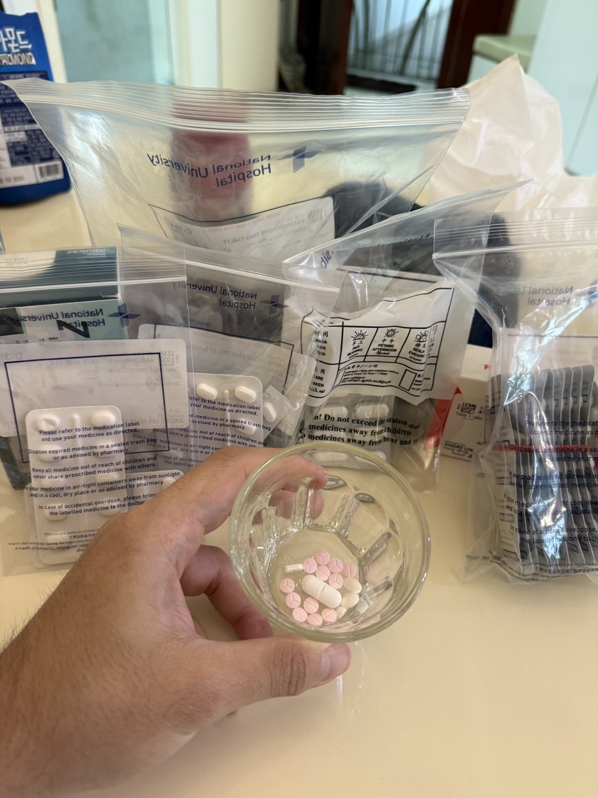

Life works in mysterious ways. It seems to know how to tailor its challenges, delivered at precisely the wrong time, to precisely the right people. **Enough to shake us. Rarely enough to break us.**

Lately, many of my friends have been dealing with their own quiet crises. One is navigating the jilted loss of a love. Another is locked in a bitter standoff with his father, who has threatened to withdraw all support. One lost a month-long, painstakingly prepared bundle of gifts – for his beloved studying abroad – to a thief. Another was hurt, wrongly and unjustifiably, by a careless friend of mine, who somehow still found it in him to forge ahead and fervently pursue yet another girl, who also happened to be a close friend.

Tricky times. And yet, none of it seemed like it would ever reach me. **I had stability**: did well academically, offers lined up, relationships intact. And i’d say I had a fairly strong grip on my own emotions and convictions too. **I felt insulated. Unfazed.**

Until life (or God, if you prefer) **decided to take my health away.**

 

## So, What Happened?
Kidney complications. Developed suddenly. The diagnosis the doctors gave was vague. They called it idiopathic, a fancy term that short for _“we don’t know what’s up either.”_

From what I gathered, my immune system is simply over-active, deciding to attack both my kidneys.

Talk about being blessed.  
**_Too blessed._**

    
The Possible Trigger..?

    
        On 1st November, I re-visited <b><em><a href="https://www.surreyhillsgrocer.sg/?srsltid=AfmBOopcQa0hE1VOYXv46lMXCfVHRLzzR7mp3O1B6dviVRVWKygqJnxw">Surrey Hills Grocer</a></em> (ION)</b>. The best thing on the menu, in my opinion, was a ridiculously overpriced ($19) truffle fries, which says a lot if fries are your strongest selling point. There were some interesting dishes, but <b>nothing tasty enough to overpower the taste of financial regret</b>.
          
        The ambience though, was good – very suitable for dates — if not for the tables being so tightly packed that I could hear every awkward attempt at flirting from the couple next to us on what is clearly their first date. The choice of topics the guy chose was certainly unconventional but entertaining. My partner agreed, though that didn’t stop her from kicking me under the table every time I accidentally giggled.
          
        The only thing I ordered differently was a <b>prawn risotto</b>. We ordered quite a bit, typical of my gluttonous self, and I devoured most of it. What followed were hours of bloating, but nothing particularly alarming for someone who is a slave to his own tongue. Aside from some fatigue, the night passed peacefully.
          
        The next day, the bloating didn’t subside. I chalked it to a combination of stress, lack of exercise, and disgusting amount of food in one sitting. So, I decided to run a half marathon. Best timing yet: 5:10 pace for 21km on a damned treadmill (yes, a treadmill so I could watch a lecture, ironically titled <b><em>Death, Suffering, and Illness</em></b>).
    

 

## The Symptoms
The symptoms unfolded quietly over the week. It began with my legs looking slightly swollen. I thought little of it, figuring it was just due to running hard the previous day (see above dropdown).
_Dead wrong._

Strangely, I lost my appetite. Food poisoning, maybe, except there wasn't the diarrhoea I was expecting, just one minor episode. Still, I found myself surviving on soup and porridge.

By Tuesday, the swelling had worsened. Walking became much harder. Still I thought I could tough it out.

By Wednesday, I figured I should probably exercise. I felt heavy. Bloated and fat even. I blamed excess calories from the past few days. Climbing helped a little, but in hindsight it’s probably due to adrenaline. A friend commented that my feet looked ridiculous, and indeed, I couldn’t fit into my climbing shoes without forcing them on. The signs should have been obvious. I was struggling on climbs that had previously come easily. Little did I know I was [crimping](https://5.life/blog/2024/05/01/crimp-climbing-101-the-essential-techniques-and-training-tips/) far above my actual body weight.

What finally made me reconsider was puking up even the water i drank after the climb that same night.

The doctor at USC (campus healthcare centre) thought it was likely food poisoning with some water retention and prescribed medication. ChatGPT also gave a similar diagnosis before this. Reassured, I went home expecting to feel better the next day. I did not. It worsened.

Friday, I was plagued with headaches, more bloating, and increasing immobility. Still, I dragged myself to school to catch up on work. NUH was nearby and if anything, I could always drop by for a second opinion.

After some persuasion from the same friend, I finally went to A&E. Initial assessments were dismissive. Food poisoning, perhaps. As I waited, I began to feel increasingly unwell, gagging uncontrollably until only gastric acid came up.

    
A Very Interesting Man..

    
        This friend of mine is what you might call paranoid. Overly so. He’s the kind of person who dreads flying after intentionally sourcing and reading everything that could possibly go wrong. Same with boats. 
          
        He once checked himself into the hospital for a prostate exam based on what appeared to be the most remote of symptoms, and spent half a day, during peak exam period, analysing his own stool. He took multiple photos, studied their shapes across a distribution, extracted RGB values, and compared them against references on the Bristol stool chart. <em>Some effort.</em>
          
        He had also spent enough time reading in different medical rabbit holes to offer me a partial diagnosis, and seemed to understand what the doctors were discussing about my kidneys better than I did.
          
        But then again, he is a student of Mathematics, and I don’t know many great mathematicians, or logicians (see Gödel), who aren’t at least a little paranoid.
    

 

The doctor finally came around to see me. It was interesting to watch a calm expression slowly give way to confusion and urgency. She shook her head and murmured that the symptoms didn’t add up. What followed was a rectal exam, an impromptu blood test, a urine test, and thirty minutes later, I was effectively under hospital arrest. They refused to let me leave and warded me immediately.  _Seems serious._

The junior doctor had no idea what was going on but the blood results showed severe abnormalities. That’s when the senior doctors stepped in. But they were equally unsure. So began the race against time. 

It was around then that I was escorted by the nurse to check my weight. **A whopping 84kg**. It was a confusing number. My first thought was that the scale was wrong. It had to be. **I was 65kg**. 

  <figure style="margin: 0; text-align: center; flex: 1;">
    
    <figcaption><em>Before hospitalised when symptoms developed</em></figcaption>
  </figure>
  <figure style="margin: 0; text-align: center; flex: 1;">
    
    <figcaption><em>After hospitalised when it persisted</em></figcaption>
  </figure>

 

    
Horrible Swelling

    
        The swelling worsened over the next few days. It became a running joke, though perhaps one that stopped being funny rather quickly, that I had a swollen groin enough to make OnlyFans actors and claims in porn ads seem modest. Amusing for a moment, but concerning shortly after.
          
        At one point, I couldn’t walk for more than ten minutes without feeling exhaustion and my feet feeling like they were about to burst. I had to walk like a crab simply because walking normally wasn’t physically possible. Prolonged walking or standing made things worse as gravity dragged the fluid downward.
          Peeing was difficult too. I could not pee normally, nor even shit normally since I could not sit on the bowl properly, and i'd make a mess of myself every time I urinated. It was slightly sad to see how i've been reduced from the man I was just a week ago.
          
        You would think lying down would help. In a way, it did, by redistributing the fluid. But it causes some of the internals in my body region to swell and hurt, and ill be forced to sit upright again. I don’t think I slept more than three uninterrupted hours the past month. Can't be good for the brain..
    

 

## Enter: The Kidney Specialists
The full blood results came back. And the numbers were approaching dangerous territory across the board. What was thought to be food poisoning turned out to be kidney damage. Now, things were serious. 

More doctors came and went. it was originally frustrating to watch the uncertainty persist, and I briefly considered transferring to Mount Elizabeth. Then Prof Hoey (Head of the NUH Nephrology Department and Adjunct Professor at Yong Loo Lin School of Medicine) dropped by and for the first time, concrete instructions were given to the nurses and I heard some semblance of a plan.

    
The Silverlining

    
        Not long after, I realised my own <a href="https://www.nuhs.edu.sg/patient-care/find-a-doctor/doctor-details/Chua_Yan_Ting">cousin</a> is a kidney specialist at NUH, though she was on maternity leave at the time. I had always thought she worked in bone marrow.
          
        Despite being away, she showed immediate concern and a sense of urgency I deeply appreciated. From home, she reviewed my results, offered a preliminary diagnosis, and stayed in close contact with her colleagues. She often knew much more about my own condition than I did.  
          
        She helped expedite several procedures and escalated my case to her seniors. Soon, I found myself under the care of senior nephrologists, some of whom were her own mentors, and I was assured they are the best kidney doctors in Singapore.
    

 

## The Scare
They had no idea what was wrong. But they knew something was amiss. So, they drew so much blood I could’ve started a bank. And they brute forced all sorts of tests. I was on a strict diet restriction and all input-output had to be tracked. Doctors rotated in and out, many, I realised on Saturday duty, came to check on this medical oddity. It was only when Prof Hoey entered when I first heard some conclusive instructions handed down to the team of doctors and some medication prescribed. 

Early on the possbility of terminal illness was raised. **That was scary.** They couldn’t rule it out and told me to prepare for the worst. I didn’t tell anyone, it was too surreal and I wasn’t sure I understood its gravity. 

Costs ceased to matter. Everything was expedited. Tests, scans, biopsies, and whatever they could schedule on the coming Monday. Sometimes, I could be signing a consent form hurriedly brought over and find myself in an operating room thirty minutes later.

The three long nights that followed left me pensive. Stripped of distraction, **a lot suddenly felt inconsequential**. I had time, maybe too much of it, to revisit the smaller things I’d neglected, postponed, or quietly assumed would always be there.

    
What Bed Arrest Means..

    
        An interesting experience of what they meant by bed arrest. After a minor procedure, I woke up and shifted slightly. The bed alarm went off. Within seconds, three nurses appeared and pinned me down. lol.
    

 

What followed were weeks of hospitalisation, and likely months of recovery. The doctors eventually concluded its nephrotic syndrome, another umbrella diagnosis, but suspected that my immune system had turned on my kidneys. _Strange._

**The proposed fix was simple, but damaging**. Suppress the immune system with high doses of steroids (not the muscle-building kind..) enough to break the body, but if prolonged, erodes the mind. **Unfortunate. _I’ve always valued the sanctity of the mind._**

    
    <figcaption style="text-align: center; font-size: 0.95em; margin-top: 6px;"><em>A picture a nurse took of me, but i don't recall when and why</em></figcaption>

 

## It's Not Too Bad
I like to think it’s my straightforward nature, and maybe a genuine effort to connect with people, whether that means speaking my mind or owning up to mistakes, that helps me keep good friends around. It was during this period that I realised **how strong my support system really is, stitched together from different phases of life**: decade-long friends from secondary school, my JC clique, a few from army, and several steadfast, weathered friendships from my current phase in university.

I enjoy their company. They brought me food, sat around for chats, and played games with me. My paranoid friend even tutored me on Mathematical Logic. Small things, but they mattered.

But I could feel it. **The fatigue, the weariness, the moments of daze, and the the flesh weakening**. Still, days passed better with people coming by and I felt more optimistic for a quick recovery. Maybe I could still make it for my month-long Japan backpacking trip. Maybe even the Standard Chartered Marathon in early December. _Stupidly optimistic._

    
An Attempt at Getting Mala..

    
        This close friend of mine from secondary school is, at times, a bit of a klutz. But he visited me often. On one occassion, after days of strict dietary restrictions, i figured a nice mild bowl of mala wouldn't hurt and would inject some happiness. So when he asked I wanted, 
           I said: <b>"Mala, dry, xiao la (small spice), with some meat."</b>
          
        Well, what he came with was: <b>Tomato soup-base with no meat.</b>
          
        Frankly, I think his blur nature is sometimes just a front. He cares in his own way, but is shy and not one to be upfront about it.
    

 

## Or Maybe Not..
Perhaps I spoke too soon.

At the start, I thought this whole phase would last a week at best. Then it became _maybe_ several weeks. Soon, the doctors started mentioning months. Some numbers began to take shape, something along the lines of a **full recovery in six to eight months**. But the most recent one I heard, also the most unsettling one, is the possibility of a **long-term dependence on steroids** or equivalent drugs. I’m not entirely sure what that entails, but it suggests immune supression for a lifetime and surely that can't be healthy.

Maybe they knew this from the start and were withholding information to pace me. _**Man.**_

    
Side Effects of Steroids

    
        The normal dose is 5mg. I take 12 pills day, which translates to 60mg. At that dosage, I’m vulnerable to a host of secondary issues, which is why I had to receive several vaccinations and preventive medications beforehand. The steroids also wreak havoc elsewhere — liver function, cholesterol levels, blood pressure, etc. So I take several other medications alongside it. There might also be a possible impact in cognitive abilities in the short-term.
          
         How I wish these steroids were the kind used for muscle building instead.
    

 

The likely scenarios going forward as I continue the treatment:
1. **Steroids work, kidneys heal, and the immune system behaves** — Full remission (Ideal)
2. **Steroids work, kidneys heal, but the immune system attacks again** — Steroid dependency (uh..)
3. **Steroids fail or stop working** — in some cases, the body develops a resistance (Docs are keen to avoid this and we don't discuss this yet)

Historically, option (1) is rather rare. But it’s still too early to conclude anything, and the data isn’t especially representative. Apparently, my condition doesn’t usually present itself in young adults.

Anyway, **I’d heard enough too**. After a day of moping or so I figured it’s about time I restore some semblance of normalcy, or adapt to the new normal. So I requested to be warded from home.

 

**Then I fainted**.

Ok.. slightly dramatic in wording. More accurately, during one of the routine medical visits (every 3-4 days), I started feeling nauseous and dizzy in the lift. Puked as soon as I got out, and my body started spasming. Likely the result of severe electrolyte and nutrient loss — I was urinating close to seven litres a day at its peak from the diuretics. I dropped to my knees and could not move. Fortunately, I was within hospital grounds and the nurses quickly came forward.

So here I am, had enough blood drawn to start a small bank and a vault of medication large enough to start my own pharmacy. Hoping for a quiet, uneventful recovery over December.

    
    <figcaption style="text-align: center; font-size: 0.95em; margin-top: 6px;"><em>Daily medicine, just the morning one. Excuse the fatty hands..</em></figcaption>

 

## Seeds of Change (III)?

 

<blockquote>
I grow little of the food I eat, and of the little I do grow 
I did not breed or perfect the seeds. 
 
I do not make any of my own clothing. 
 
I speak a language I did not invent or refine. 
 
I did not discover the Mathematics I use. 
 
I am protected by freedoms and laws I did not conceive 
of or legislate, and do not enforce or adjudicate. 
 
I am moved by music I did not create myself. 
 
When I needed medical attention, I was helpless 
to help myself survive. 
 
I did not invent the transistor, the microprocessor, 
object oriented programming, or most of the technoglogy 
I work with. 
 
I love and admire my species, living and the dead, and am 
totally dependent on them for my life and well-being. 
  
Sent from my Ipad
</blockquote>

 

_- a dying Steve Jobs, writing to himself_

 

Awhile back I wrote about a post on my trip to the [Himalayas](../seeds-of-change-2/). There, I talked about how it became a catalyst for many journeys that followed. And while I’d like to believe I’ve learned to enjoy life as it is, I can’t deny feeling haunted by the quiet pressure to chase credentials, careers, and high-paying jobs.

Fast-forward nearly two years. Things have changed. I’ve been fortunate enough to land reputable internships and receive several full-time offers — both in ML and Quant. I vacillated like a maiden unable to choose between suitors. On one hand, genuine interest, on the other, staggering cash. **We like to think we’re above the latter. Sometimes we are. Sometimes quantity still triumphs.** Or so I thought.

Now, it all feels strangely hollow and even trivial. While hospitalised, I came across an email Steve Jobs sent to himself as he was nearing death. My condition is far from as severe as his was, but I could sense the man’s anguish, and resonated with it. That **despite all my effort and achievements in this world, I remained helpless when my body needed help the most.** My past worries seemed almost pointless.

The past year’s hustle is almost laughable in hindsight, only to end up, quite literally, hospitalised and unable to do anything at all or honor my commitments. Plans deferred to December. Promises made to loved ones. Mental notes of payback time. **And once again, life intervened.**

But perhaps the inner voice is clearer now.

I’ve also decided to revisit some old companions: _Camus_, _Dostoevsky_. Seasonal reading, if nothing else. Not that I can do much besides stay home for now. Who knows, maybe I’ll start writing about them too.

Clarity has been a sharpened knife lately. I’ve traded some boisterous energy for something quieter, more pensive. And maybe that isn’t so bad. What comes next will likely involve more reading, more intention, and a **more deliberate way of living**.

   

    
The doctors may say its idiopathic..

    
        But I know in my hearts of hearts.. this is the cause: 
        
    

