

Krabi has this annoying habit of leaving me nostalgic and a little bittersweet. The beaches are calm, the food is cheap, the backpacking vibe is alive and well, and Thai people somehow manage to be warm without trying too hard. It’s a quintessential backpacker's place for youngsters like us who still think sleep debt is negotiable.

Last year, I got close to Rizhao (see this [post](../seeds-of-change/)). We shared plenty over that trip, and some of the things he said stuck with me longer than I expected. This year, it’s my turn to leave an impact. I'm bringing 34 fellow climbers, some of whom have never touched outdoor rocks, into the wild and hoping everyone comes back with all their skin intact.

This trip was the culmination of a year's worth of effort. A product of my brainchild (Well, not exactly, see the dropdown below). Over the past year, I've barged through hurdles and regulations with ambitious, uncharted outdoor climbing plans for the school. Those were uncertain times, and I’ll admit there were moments where the entire plan was held together not by backup options but by hustle and the kind of faith you only earn after it works. Not everyone was fully onboard, and coordination was difficult, and sometimes things looked bleak. 

But here we are :)

    
The OGs

    
      What we pulled off wasn’t a one-man job. If anything, it was me imposing on a number of people. These are the OGs who stuck with me throughout: 
        1. Wen Wu — Early on, we clashed. But once I had gotten his unwavering support, my goodness did we accelerate.  
        2. Chi Ying — The team player you'd want. He may voice apprehension but he follows through. I appreciate the trust he showed in me. Far too many times i've relied on him, and for that, I am grateful.  
        3. Na Wei — Getting her to understand what needs to be done is half the battle. Okay that might be harsh lol. But once she locks in, she delivers.  
        4. Joan — She is the only one that isn't from Mountaineering club but somehow found it in her to tolerate my last-minute demands since Day 1 as marketing lead. Mad.   
        5. Giovanni — This outdoor climbing initiative was technically his vision. But he swayed me into engineering the solution. A trusted advisor.
    

 

# First Phase: Main Gang Climbs

## New Friends & Old Friends
The past year brought new faces into the journey. A few became frequent climbing buddies. But everyone was excited for what was coming. It was surreal that it was finally happening.

<figure style="margin: 0 auto; text-align: center; max-width: 80%;">
  
  <figcaption><em>Lance at the airport, picturesque as always</em></figcaption>
</figure>

 

Day 1 was smooth enough. Plane. Land. Chartered bus. Villas. Food. Oh and already some parading and shameless flexing with a Thai diner auntie. The excitement and chatter that night brought little sleep.

We were overly specific with our choice of villas and we can thank Na Wei for scouting and camping for the best deals that met our annoyingly strict demands. After all, it matters. A good common area and decent amenities go a long way to ensure ample space to breed shenanigans, laughter, and simple fun.

    
Well, there was one slight hiccup..

    
      This trip marked the end of my 1-year term as EXCO (leadership role) in both the Mountaineering and Climbing club. It's also It's also where I identified two prospective understudies, one from each club, to take over and continue collaboration.
        
      Nyan (Mountaineering club) was also the logistics guy for the mountain of gear we were hauling. He underestimated the time needed to get to the airport and we nearly couldn't check-in our massive baggage. <em>What a scare</em>.
        
      Somehow, we managed to convince airport staff to let it through. Partly because of flight delays, but mostly because of Nyan's shamelessness. He is a total clown, but somehow has this scrappy ability to deliver. Far too many incidents later, he earned the title of “weirdest host.” His humour is.. for the bros. Maybe not so much for the ladies.
    

 

<figure style="margin: 0 auto; text-align: center; max-width: 66%;">
  
  <figcaption><em>Multi-pitching with Timothy, moments before diaster.. :')</em></figcaption>
  <em>but a story for another time.</em>
</figure>

 

Here's Timothy, the understudy from Climbing Club. I'm grateful we met. And he's the one who will ensure my efforts continue. He's always been a good sport about everything. His optimism, genuineness, and willingness to emotionally invest in friendships are traits I value, and I keep such people close. 

<figure style="margin: 0 auto; text-align: center; max-width: 66%;">
  
  <figcaption><em>Day 1 and here's our first clown flexing with local Thai ladies.</em></figcaption>
</figure>

 

Glad to also have familiar faces and fellow mountaineers join on the trip. Here's Evie and Huzefa.

<figure style="margin: 0 auto; text-align: center; max-width: 80%;">
  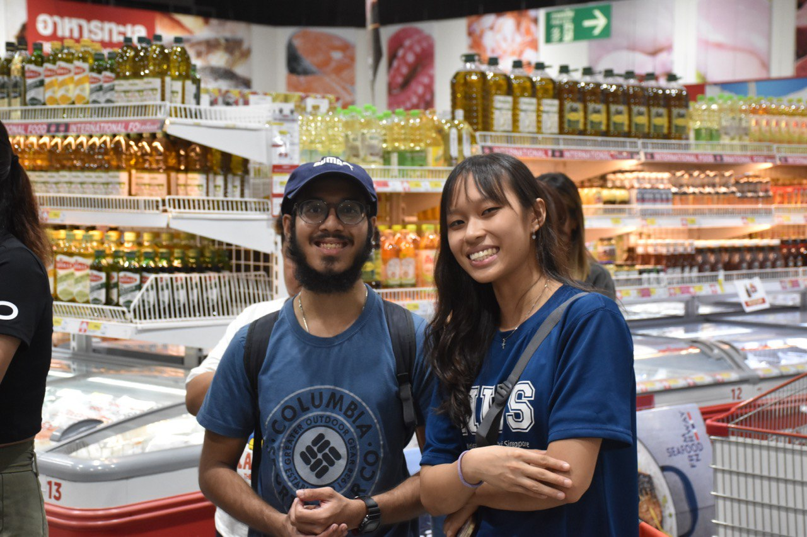
  <figcaption><em>And then Huzefa sprained his ankle the next day.. while being belayed by Evie..</em></figcaption>
</figure>

 

_Fun memories._

## Climbs
We are a huge gang, so we had no choice but to split ourselves. Overcrowding one crag is disrespectful to the locals and clustering creates fertile ground for conflict. Tahnkfully, I had Wen Wu and Timothy to bring the other half elsewhere. We rotated sites by the day. Here's my gang at Northwall.

<figure style="margin: 0 auto; text-align: center; max-width: 80%;">
  
</figure>

 

Northwall was filled with limestones. The morning sun filtering through the mist gave it a sort of raw, elemental beauty.

<figure style="margin: 0 auto; text-align: center; max-width: 80%;">
  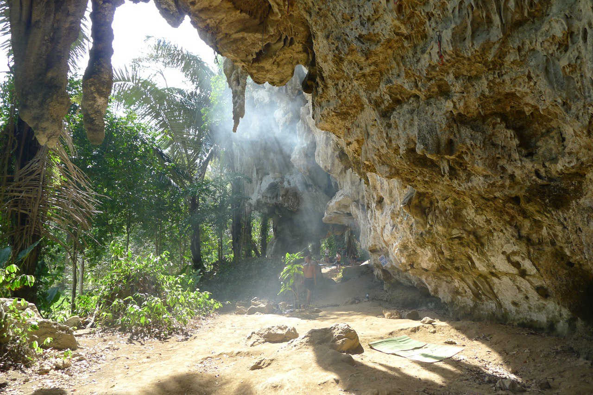
</figure>

 

The plan was simple. Climb, order food and drinks, climb more, order more drinks (milkshakes were cheap and honestly lifesaving after an intense climb) before calling it a good day. Everyone was as vigilant as they were excited. I didn't have to babysit much, and managed to clock 4-5 nice climbs every day. _Nice_.

<figure style="margin: 0 auto; text-align: center; max-width: 80%;">
  
  <figcaption><em>Setting up routes for those who are top-roping.</em></figcaption>
</figure>
 
<figure style="margin: 0 auto; text-align: center; max-width: 80%;">
  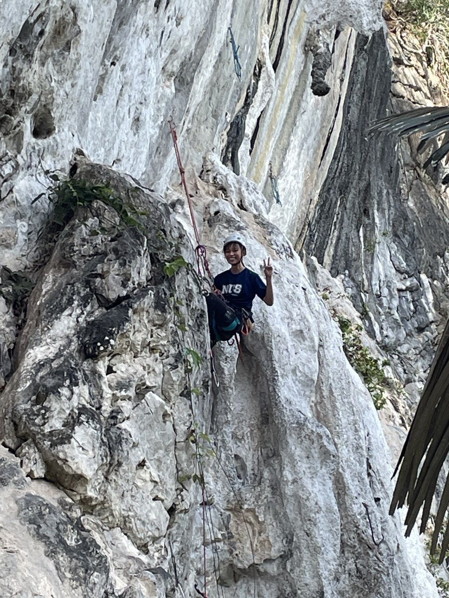
  <figcaption><em>Evie setting up too, captured from my angle.</em></figcaption>
</figure>
 
<figure style="margin: 0 auto; text-align: center; max-width: 80%;">
  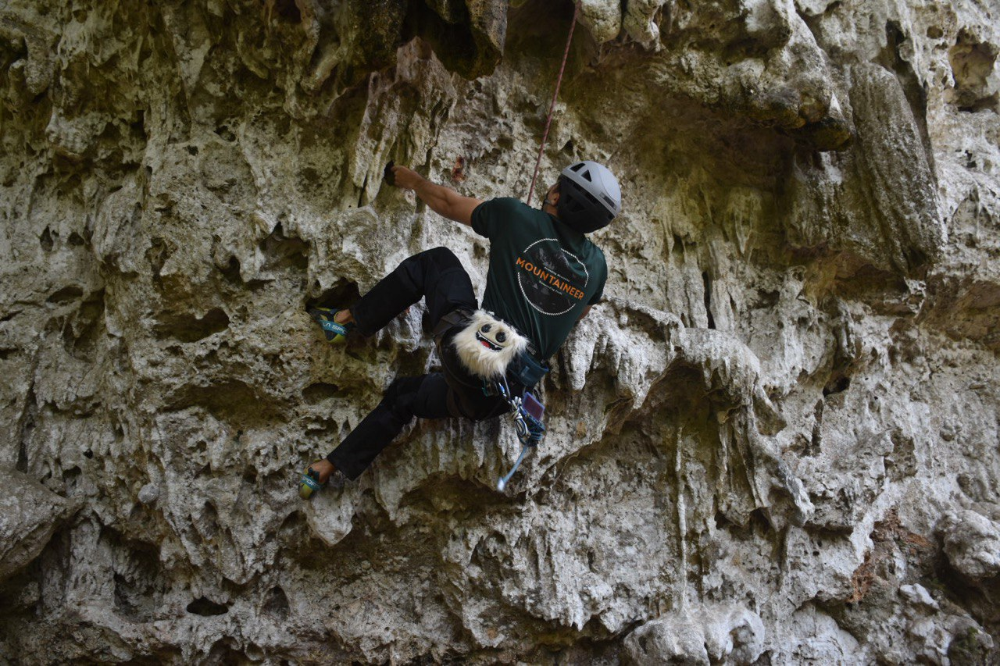
  <figcaption><em>Another shot. Gotta thank Joan for going around to take pictures.</em></figcaption>
</figure>
 
<figure style="margin: 0 auto; text-align: center; max-width: 66%;">
  
  <figcaption><em>Classic climbing drip.</em></figcaption>
</figure>
 
<figure style="margin: 0 auto; text-align: center; max-width: 80%;">
  
  <figcaption><em>Lots of route reading too.. and we still got stuck.</em></figcaption>
</figure>

## Chill Times
We packed up around 16:30 daily to give us ample time for bonding, dinner, and recharge. Every night followed a familiar enough template.

Some would account for gear. Some would clown.
<figure style="margin: 0 auto; text-align: center; max-width: 66%;">
  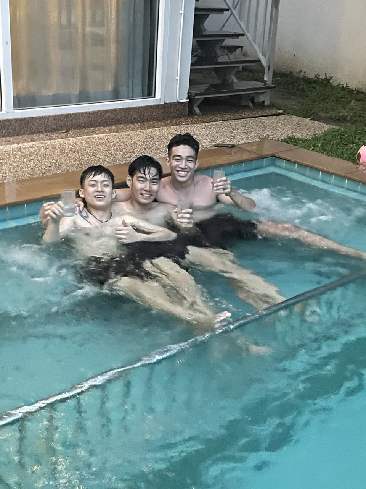
</figure>

 

Then we would wash-up for a wonderful dinner.
<figure style="margin: 0 auto; text-align: center; max-width: 80%;">
  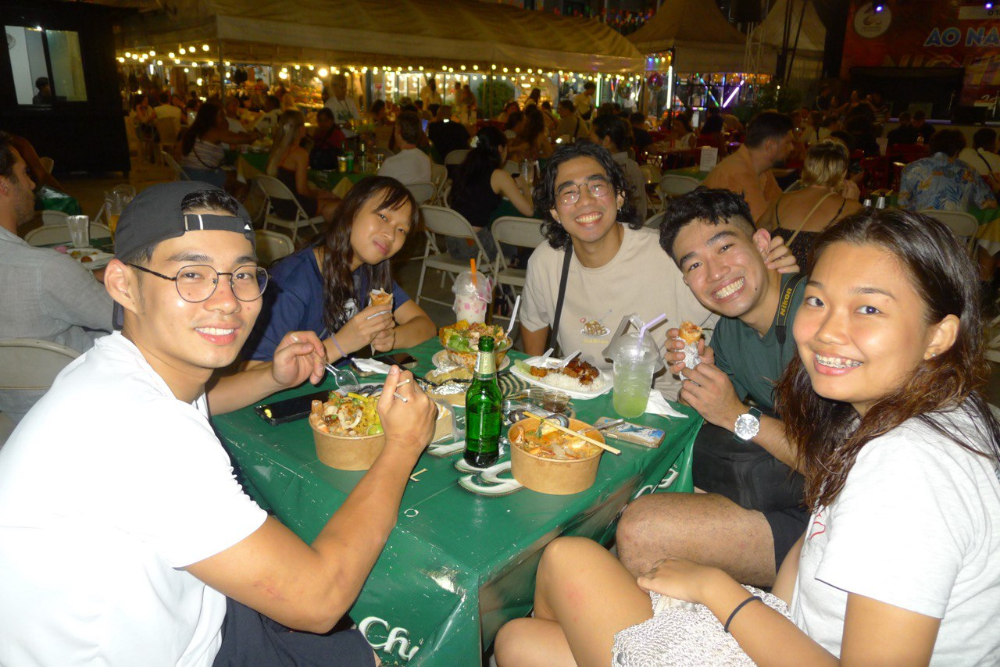
</figure>

 

Chill and chit-chat.
<figure style="margin: 0 auto; text-align: center; max-width: 80%;">
  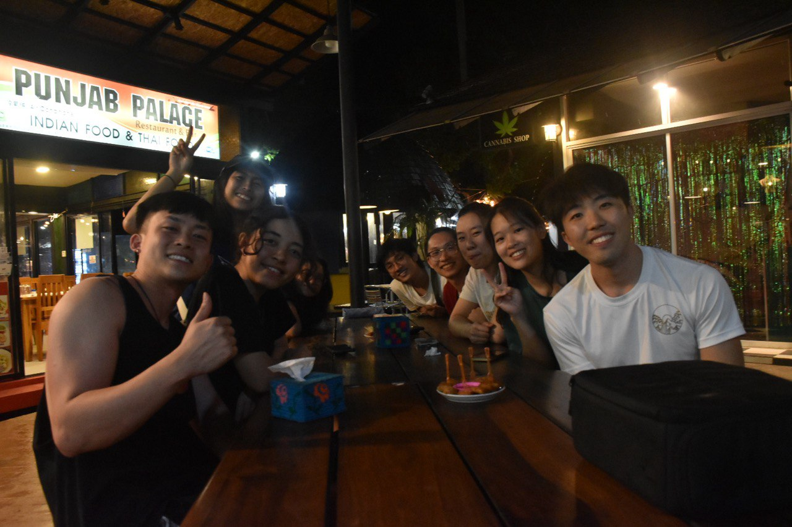
</figure>

 

Finally, head back for board games, or drinks, led by our own **in-house alcoholic**. I have literally not seen a day (or even a few hours) go by without Na Wei hugging some bottle. _Truly impressive_.

<figure style="margin: 0 auto; text-align: center; max-width: 66%;">
  
</figure>
 
<figure style="margin: 0 auto; text-align: center; max-width: 80%;">
  
</figure>

## More Climbs
The next few days were rinse-and-repeat. The formula worked well. But it wouldn't be Krabi without the beach, so we headed there to climb. Frankly, it was too hot and too crowded with tourists. But Railay is still a nice visit for anyone who hasn't been before.

<figure style="margin: 0 auto; text-align: center; max-width: 66%;">
  
</figure>

I was too occupied with climbs, or rather, securing routes to climb (the local guides took priority), so I didn't take many pictures. Here's some rock I thought was cool and Nyan hugging for his dear life.

  <figure style="margin: 0; text-align: center; flex: 1;">
    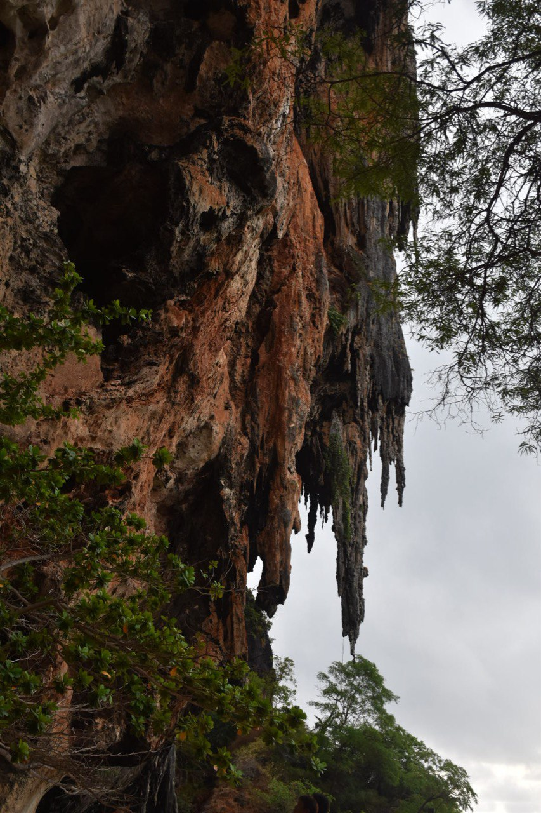
  </figure>
  <figure style="margin: 0; text-align: center; flex: 1;">
    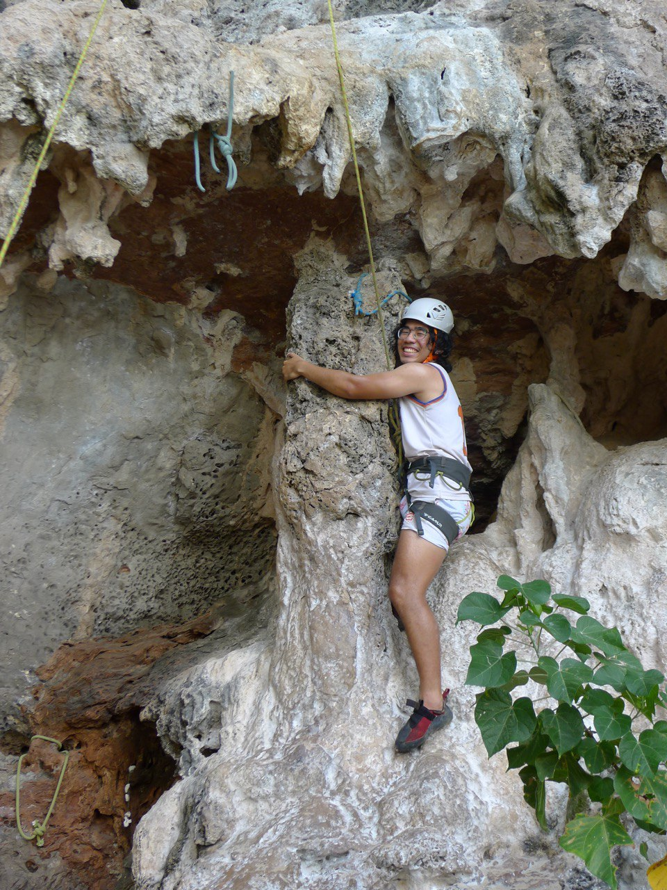
    <figcaption><em>Nyan barely left the ground lol.</em></figcaption>
  </figure>

 

## Recovery Day..? Thanks Timothy!
After days of climbing, we wanted to have a relaxed day to let ourselves recover. Except it was anything but chill. It was a fun-filled day of activities, courtesy of Timothy, who anchored much of the planning.

We kickstarted the day with whitewater rafting:
<figure style="margin: 0 auto; text-align: center; max-width: 66%;">
  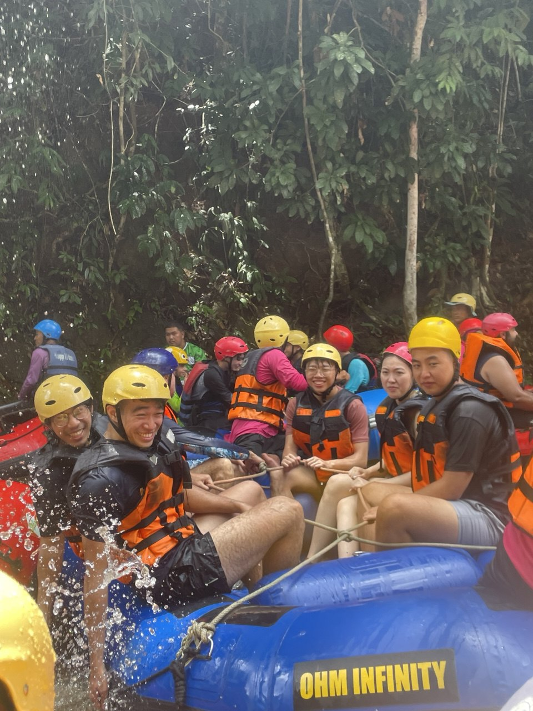
</figure>

Then an ATV tour, where someone somehow flew out of his vehicle..
<figure style="margin: 0 auto; text-align: center; max-width: 66%;">
  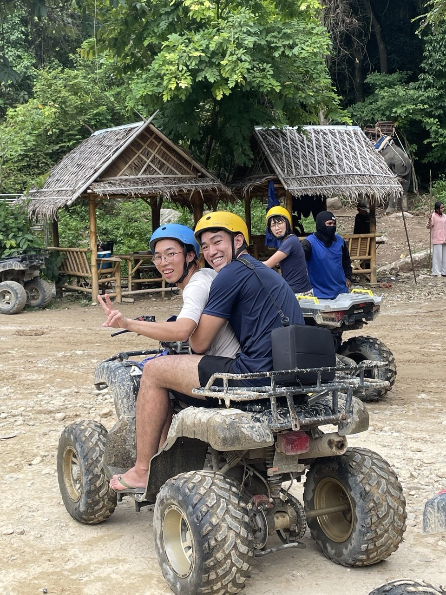
</figure>

Some shenanigans featuring 5 idiots:
<figure style="margin: 0 auto; text-align: center; max-width: 80%;">
  
</figure>

Visited a national park where we ended up swimming in the river:
<figure style="margin: 0 auto; text-align: center; max-width: 80%;">
  
</figure>

And we ended the day with my favourite restaurant Rizhao brought me the previous year, Ruenmai.
<figure style="margin: 0 auto; text-align: center; max-width: 80%;">
  
</figure>

Somehow, we pulled off an accounting miracle (aggressive cost-cutting..) and treated the whole club to a free dinner! Nearly **$1,000 SGD worth**. I'm quite proud of this feat. I still keep the receipt for memory’s sake.

But all that still wasn't enough fun for the boys:
<figure style="margin: 0 auto; text-align: center; max-width: 80%;">
  
</figure>

## Farewells
You might notice the pictures feature mostly the same people. That's intentional. They are closer friends who I figured wouldn't mind me writing about them and posting some unglams. 

But here's (mostly) everyone who joined the trip. Each has their own unglams taken, stories told, and memorable moments. These stories shall stay in Krabi, and in our memories. Glad to have crossed paths with everyone.

<figure style="margin: 0 auto; text-align: center; max-width: 80%;">
  
</figure>
 
<figure style="margin: 0 auto; text-align: center; max-width: 80%;">
  
  <figcaption><em>And who can forget the committee that made it happen.</em></figcaption>
</figure>
 

All good things must come to an end. Temporality is what gives them meaning. For the main group, this was the end of the trip. But for **a few lost souls yearning for one more encore**, it was the start of a backpacking trip across Thailand, from Krabi to Bangkok.

 

# Wen Wu — A Dear Friend That Came To Be
Before I share about our Thailand escapades, I want to dedicate a small section to a friendship that grew over the past year. We were from different mountaineering expeditions. I was in Summer and he was in Winter, right before mine. But our EXCO terms coincided, and we would find ourselves working increasingly more with each other.

<figure style="margin: 0 auto; text-align: center; max-width: 80%;">
  
  <figcaption><em>This is Wen Wu.</em></figcaption>
  <em>"I wasn't sure where to put my limbs, so I defaulted to being lowered.."</em>
</figure>

 

And things were rough at the start. He ran for president and I backed out from core leadership to pursue this project instead, knowing it would distract me from routine work, and also buoyed by his promise of steadfast support.

But that support wasn't always present. **On one hand, he would say his support is unwavering**, that he would assist as best as he could, **yet on the other, he'd be the one objecting, poking holes, pointing out flaws, and refusing commitment**. To me, it felt like betrayal. _Pure frustration_. The club president, paralysed by indecision and constant worries, very disappointingly displayed a marked lack of trust in me.

The tinder and wood were set, just needed some embers to light the flame. **And it came**. I don't remember the trigger, but what followed was a heated argument.

A much needed heartfelt, heated argument. But it is also why I find this friendship very much worth the effort. We are similar (_save, perhaps the indecision part; i'd say i'm a bit more reckless.._) We poke holes. We see flaws. We want to be honest and genuine. And we both have enough maturity to recognise when we're wrong, even if stubborn souls like us aren’t exactly easy to convince.

After that, his support became real. Lots of late night discussion, balancing school, pushing this project forward, ungodly hours (1-2am) at USC boulder wall, and a stronger friendship than before.

And i'll soon find out Krabi had more surpises for us. Six of us were going backpacking, yet somehow under Aphrodite's spell (_on others or me.. it's debatable_), I ended up forced to be Wen Wu's date for the next few days _:)_

 

# Second Phase: Backpacking Thailand
This was mostly unplanned. Yeah we're a bunch of improvisers when it comes to ourselves. But it mostly worked out. We’d explore in the day, then take night trains to the next city.

<figure style="margin: 0 auto; text-align: center; max-width: 80%;">
  
</figure>

<figure style="margin: 0 auto; text-align: center; max-width: 80%;">
  
  <figcaption><em>The Gang: Jing Wei, Na Wei, Evie, Wen Wu, Myself, Chi Ying</em></figcaption>
</figure>

 

Most days, we had no idea what we would do. But that didn't stop us from making the most out of it. And it certainly didn't stop Na Wei and Jing Wei from drinking their way through Thailand.

<figure style="margin: 0 auto; text-align: center; max-width: 66%;">
  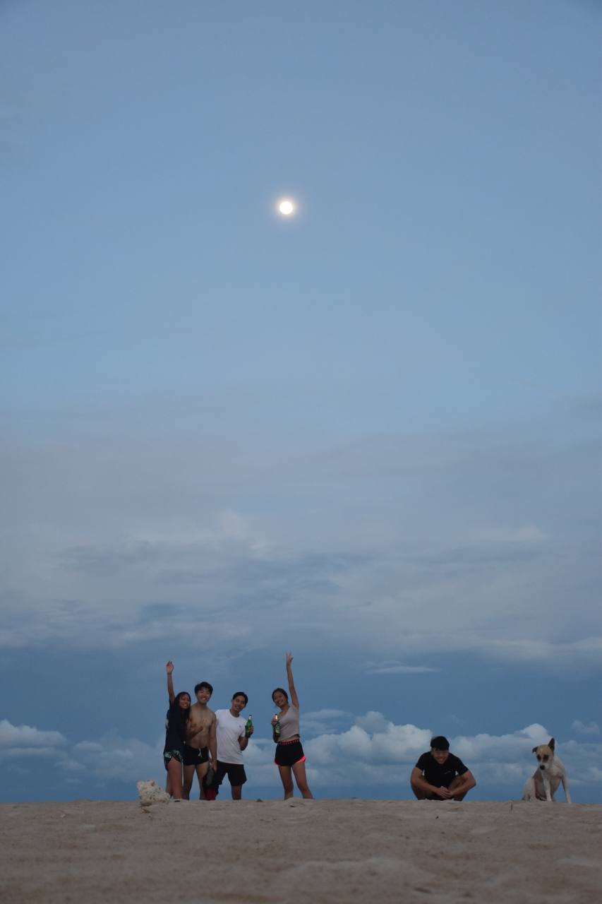
  <figcaption><em>One of the Thailand's many pretty white beaches that we visited</em></figcaption>
</figure>

 

We also had no idea how we’d get to the next city, but somehow ended up in a pick-up truck that delivered us exactly where we needed to go.

<figure style="margin: 0 auto; text-align: center; max-width: 80%;">
  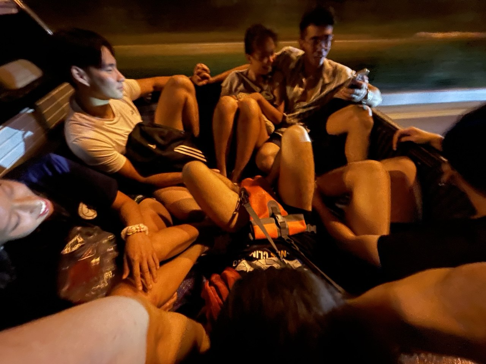
</figure>

**Blasting music, blurry reflections, very Japanese retro — [_Plastic Love_](https://open.spotify.com/track/7rU6Iebxzlvqy5t857bKFq) by **_Mariya Takeuchi_** vibes**. If you're observant, you might notice the onset of couples forming. 

Though of course, Wen Wu and I would be none the wiser until much later. _Hindsight they said_. 

We visited several night markets too. Here is Na Wei being ambitious.

<figure style="margin: 0 auto; text-align: center; max-width: 66%;">
  
</figure>

..before bailing, and Chi Ying had to clean-up.

Somewhere, sometime after a few night markets, I found myself increasingly spending time alone with one other person. Somehow, I'd go off to grab food for sharing, return, look left and right, only to find an untaken date.

<figure style="margin: 0 auto; text-align: center; max-width: 66%;">
  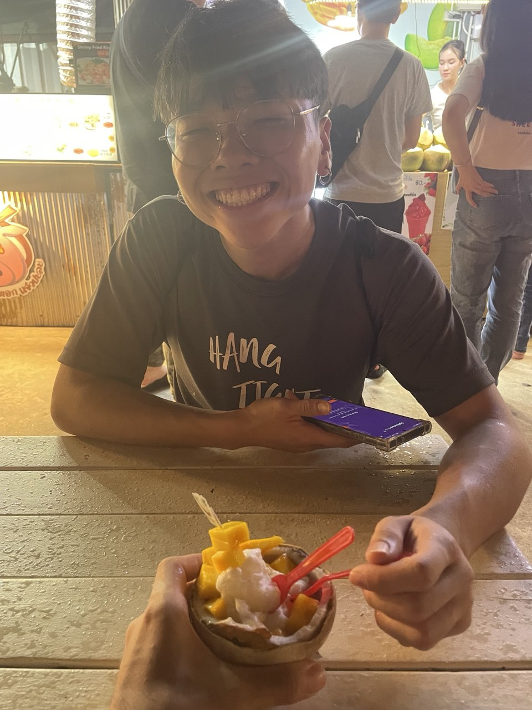
  <figcaption><em>Oh. He got his ears pierced too. That becomes funny later.</em></figcaption>
</figure>

 

We visited several temples, and were lucky to witness an important ritual, though I don't recall what it was.

<figure style="margin: 0 auto; text-align: center; max-width: 66%;">
  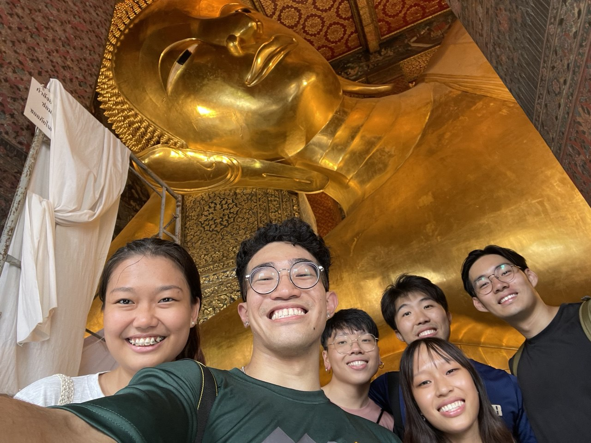
  <figcaption><em>The Reclining Buddha, I think.</em></figcaption>
</figure>

 

And we have our own.
<figure style="margin: 0 auto; text-align: center; max-width: 66%;">
  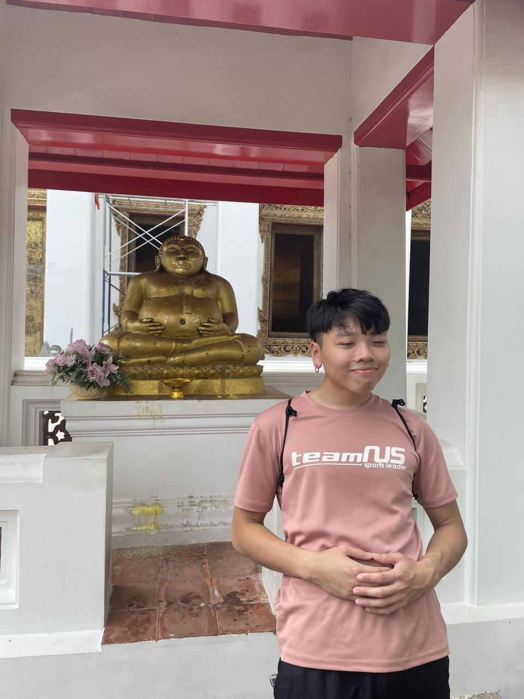
  <figcaption><em>The Wen Wu Buddha.</em></figcaption>
  <em>He would lose his wallet that night and attribute to karma for posing.</em>
</figure>

 

    
The Missing Wallet

    
      Turns out that cuckoo left his wallet in a Grab ride on the way to one of the night markets. While the others wandered off on dates through colorful stores, I spent a romantic evening with Wen Wu at the police station.
        
      And witnessed his stages of grief: from the initial shock and panic of losing his wallet, to frustration and despair, finally culminating in a peculiar kind of resignation — that this happened because he had invoked karma by mimicking Buddha's pose from earlier on, even though he is the furthest thing from a theist that i know.
        
      The silver lining, as I've come to noticed, was the Thai people. I’ve mentioned how kind they are. We've encountered countless small acts of generosity. Locals giving us directions, offering extra snacks, and just striking up friendly conversations as we wandered from place to place. This time round, when the Grab driver later realised the wallet was still in his car, he drove all the way back, an hour-long trip, just to return it. We tried to compensate him, but he refused.
    

 

The next few days were Catan, drinks, wandering, music, and laughter. Simple days. Oh but so enjoyable. I still look back from time to time and smile at how carefree we were, as we move on with our lives.

Anyway, i'll be heading Hong Kong for work soon, so I won't be travelling as much.  Hope this has been a fun read. Till next time!

<figure style="margin: 0 auto; text-align: center; max-width: 80%;">
  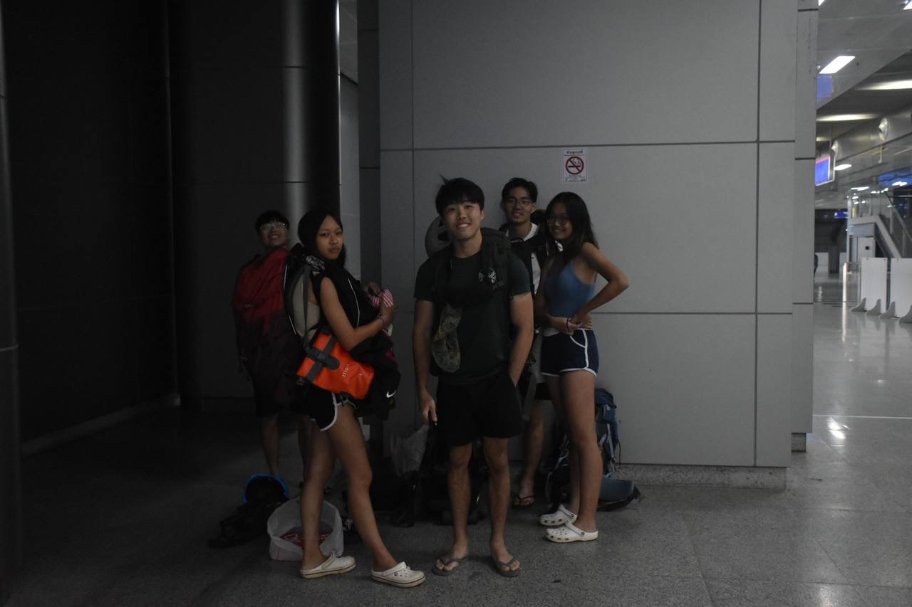
</figure>