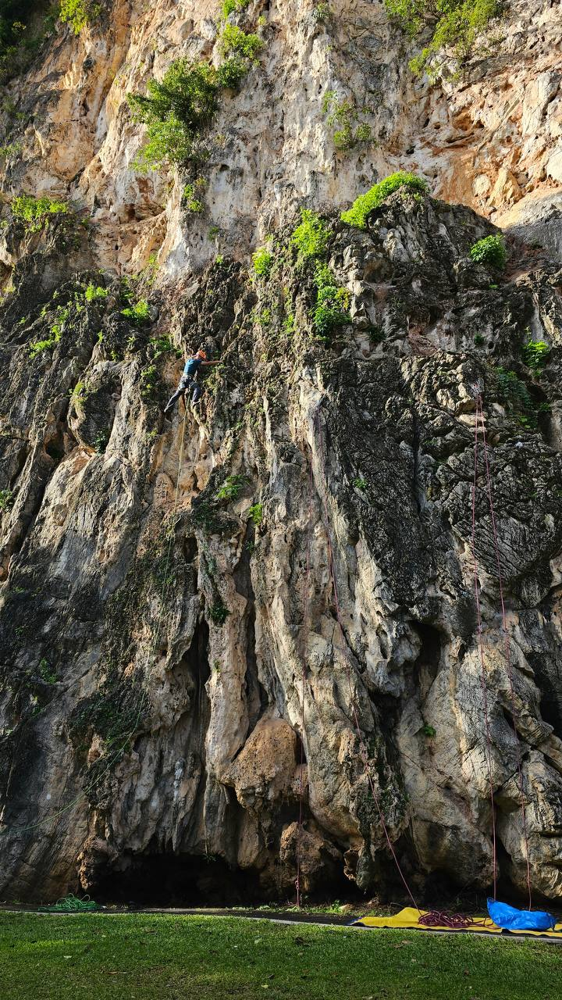
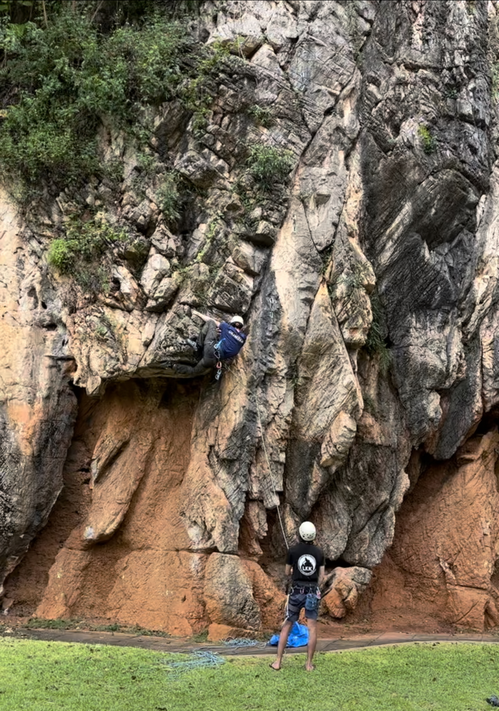
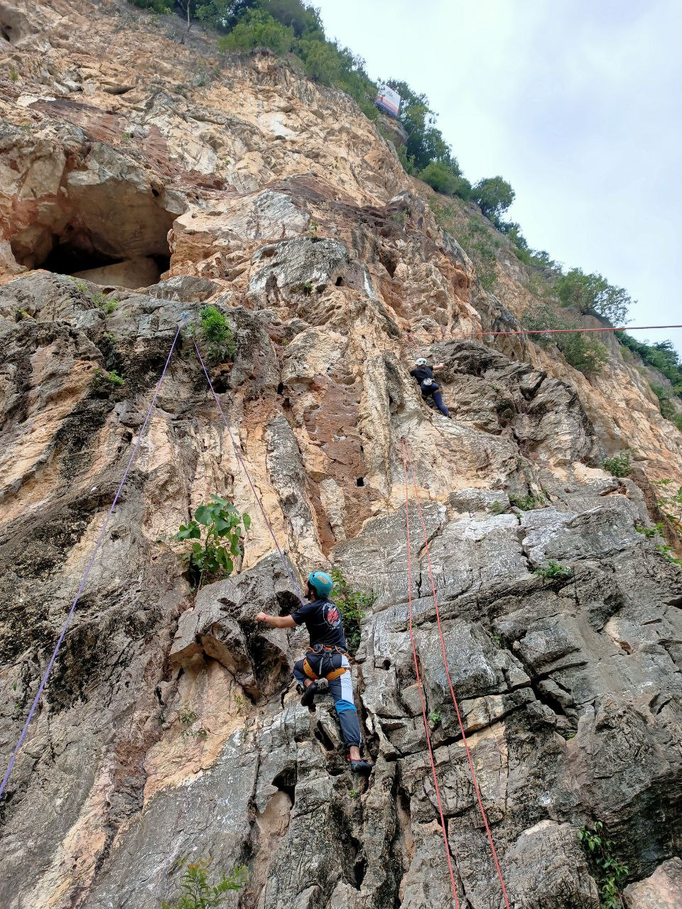
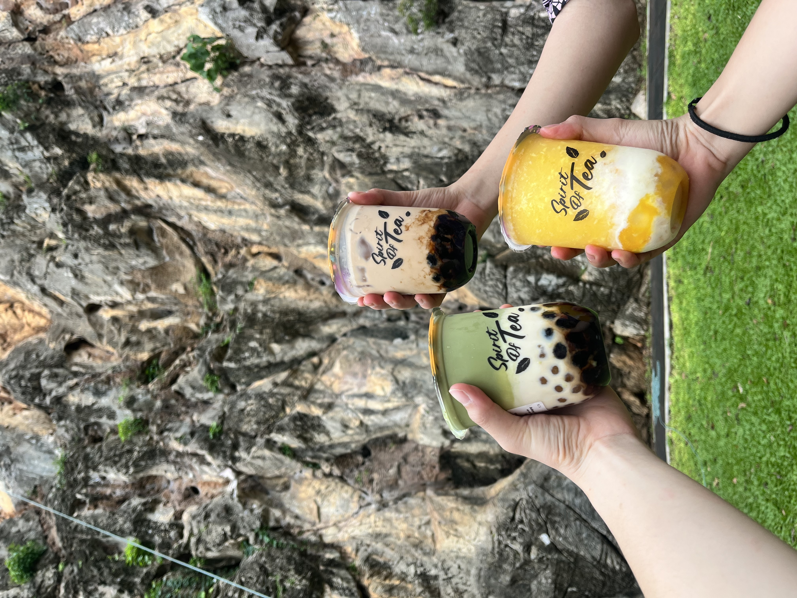
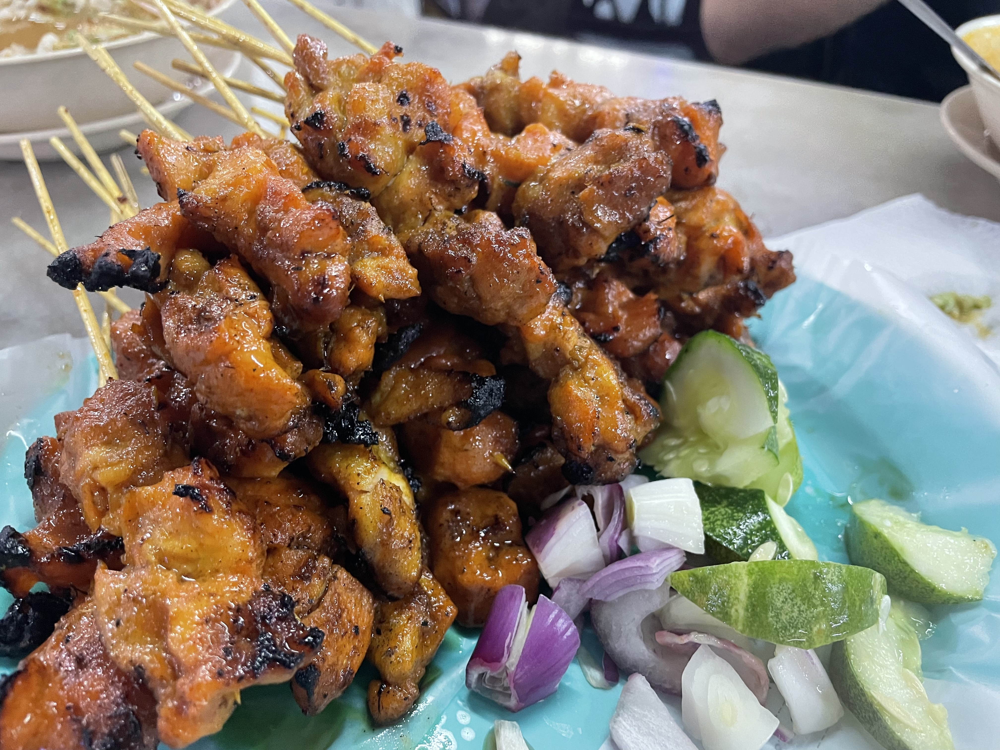
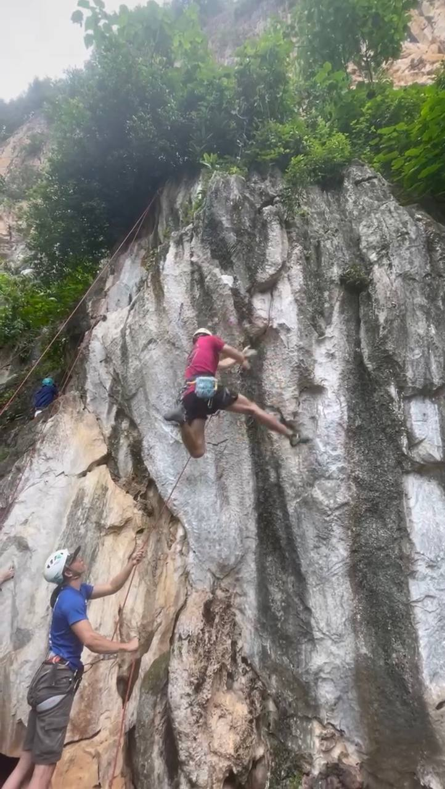
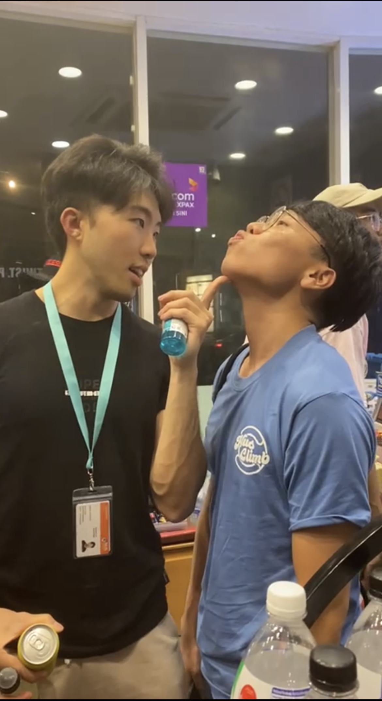

## It's Finally Time
The past 1.5 months had been a real scramble - juggling between heavy academic workload and a vibrant campus life. Actually, life outside school work was pretty much just kickstarting this pilot outdoor climbing venture. Fortunately, sign-ups were strong, people were excited, and (acquiring) logistics didn't prove to be too big of an issue - we essentially lugged our whole storeroom with us. Overall, i'd say its a pretty successful trip - nice rocks, tricky routes, and wonderful companions (most importantly, nobody died.. \*_\*).

## Lovely rocks
Some routes were challenging. Personally, i'm still stuck at 6B. I can flash and perhaps on-site 6As and 6A+s fine but 6Bs might prove a little problematic and i'd certainly need rest points for 6B+ routes. Not really a climber to be reckoned with but hey, we pick our battles and mine lies elsewhere..  Anyway, here are some sick climbing shots:

Rocks here aren't as pretty as the ones you'll find in Krabi but I think there's a nice variety with varying degrees of difficulty — ample and convenient for your average Singaporean climber and his gang of buddies.

## Some fun shots
Food and transport there is **really, really cheap**. We travelled around by grab and a 20-minute ride to Batu Caves from our hotel, split among 4-5 costs us a measly 2-3SGD each. We had 2 full days of climbing and pretty much got our lunch and teabreak with GrabFood as well. Not just affordable, but extremely convenient, helps us focus more on our climbs haha. Food served right after descent is especially scrumptious.

(p.s. Also, KFC in Malaysia does taste better.. :O)

 

## Here's a short summary of what I did:

I ate alot.

 

Fell alot too. 

 

Flirted a little. 

 

It was a good respite from all the madness during the semester.

## At what cost..?
I was desperately scrambling for time before the trip. Had a midterm to mug and loads of assignments to submit the night before the trip. 

And technically.. I didn't complete all of them. There was one remaining (and I will soon discover, extremely tedious) assignment left that was due on the following monday, but I figured i'll rush it at night after returning to the hotel (once again, no idea where this unearned confidence sprung from). I quickly learned that was a mistake.

I thought I would be able to get some progress up on the 6-hour bus ride to KL but days of mugging and submissions left me sleep-deprived and I crashed hard as a dead log. I will refrain from sharing my caught-in-4k unglams here LOL. Anyway, I had 3 nights (Saturday, Sunday, and Monday) left to churn my submission out. Pressure was on, **GAME ON!**

**And I failed.** 

First night I feasted, no excuse here oops. 

Second night, I came back all worn-out from the climb but persisted. Made some progress but alas, I was still far from done and it was nearly 3am. 

I was waging it all on the last night - night it was due. But [Haidilao](https://www.haidilao-inc.com/sg) (a popular hotpot chain) got to me first.. 😋

Thankfully, there is a 1-week grace period for submission and the penalty is only 2 marks. Though this 2 marks, as I would find out, translated to 1% of my final grade. I sure hope this doesn't bite me in the ass on results day..

## Thoughts
The trip was great. And I was glad we managed to pull it off. But that doesn't mean there wasn't room for improvement — in managing myself and providing a wholesome experience as a host. The feedback from participants were mostly positive. But perhaps what is equally heartening as regretfully not done is the point raised up that some participants were hoping to interact with us host climbers just as much during the night (leisure) as in during the day. 

Unfortunately, most of the hosts are my fellow club members who happen to be equally bad in time management as I am. We ended up scrambling work and submissions on our nights there. Probably should've used the time as one for gathering and learning more about one another outside of climbing.

Well, that's over. I have a bunch of upcoming midterms and several interviews lined up. 🤞 I land a job. Time to buck up and double down on the academic frontier. I'll probably vanish for awhile. Hopefully i'll return soon, and not too broken.

