

<b><em>"We cannot lower the mountains, therefore, we must elevate ourselves."</em></b>

# Himalayas, Nepal
The 5-day extraordinary Krabi trip left me with a heavy heart. But there wasn't any time to ruminate over parts of life just yet. We have undergone roughly 4 months of grueling training. Now, it's time to scale the Himalayas, time to witness its ethereal beauty. The energy within the team was vibrantly infectious. And why wouldn't it be?

Views were stunning. I'll let the pictures speak.

  

  

  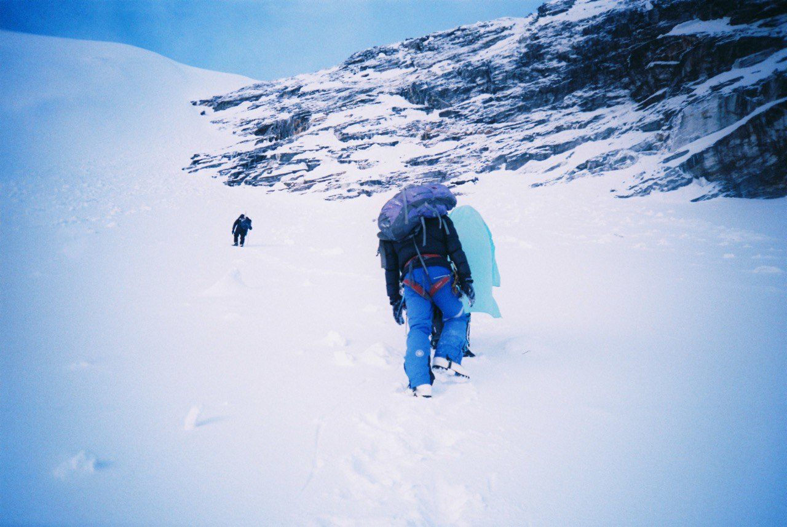

 

## The Hike Begins
We begun the track from Syabrubesi, a small village at an altitude of 2,380m above sea level. It serves as the starting point to Langtang Valley. It was a long, narrow, bumpy, **really bumpy** ride from Kathmandu. Occassionally i'll open my eyes, look out to the window, and see how teasingly close we are to the edge of some spiraling road, down to a nausealy tempting valley.

    
Nepalese Car Horns Are Strangely Musical

    
      I noticed the car horns had an interesting rhythm to them. Not the typical jarring blasts you hear in Singapore, nor, honestly, in most parts of the world. There's a reason for this. The roads are narrow, under-developed, and often exposed to sheer cliffs, with mirror aids almost non-existent. So what happens when you approach a bend or blind spot? Drivers use their horns to announce their presence. It’s a form of echolocation. And over time, I suppose the manufacturers decided that if everyone was going to be honking half the day, the horns might as well sound a little more melodic.
    

 

We celebrated our arrival at Syabrubesi after a long 10-hour bus ride with Bak Kwa, a Singaporean local delight made of sweet, smoky barbecued pork. Our guides and helpers were instantly hooked. We exchanged small gifts: they shared their local treats with us, and we offered them our club shirts in return. It was strangely heartwarming to see how much they appreciated something so simple — and even more so to hear that they still wear those shirts to this day while hosting other trekking groups.

    
Bak Kwa Did Not Come Easy

    
      We brought a total of 4 kg of Bak Kwa to share, and man did it prove to be a lifesaver later on at high altitude. Heated Bak Kwa in the damning cold was simply bliss. Our Nepalese friends enjoyed it just as much. And for that, we have Davian — arguably the most resourceful of our bunch — to thank. But he went through great peril to acquire it.
        
      The stash was split into 0.5 kg of packaged Bak Kwa and another 2.5 kg of fresh slices from a famous Malaysian chain. Davian is well known for two things: his bike and his willingness to cross the border into JB for side-hustles and food adventures. Right before the trip, he embarked on a covert mission to bring back as much Bak Kwa as humanly possible. The only issue, of course, was that pork imports into Malaysia are technically illegal. But that didn’t deter him from attempting to smuggle 3 kg of fresh meat across the causeway.
        
      <b>That fateful day, he got caught.</b>
        
      Funnily enough, the immigration officer checked only the front boot, where a measly 500g sat, and completely missed the remaining 2.5 kg hidden at the back. Davian has often insisted he is terrible at maintaining a poker face, and in his panic, he accidentally offered a Muslim officer pork. Fortunately, the officer found his panic hilarious, had a good laugh, and let him go.
        
      And that is how close we were to losing our lovely haul of meat — hundreds of dollars’ worth.
    

    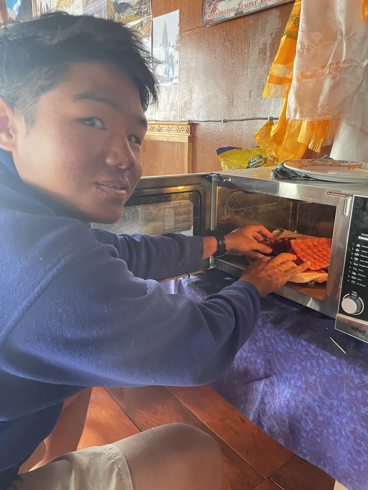
    <em>Davian cooking Bak Kwa in an inn high up the mountains.</em>

 

    
Porters..?

    
      If you’ve noticed, I’ve been deliberately avoiding the term “porters.” I learned from one of the helpers that our Nepalese friends aren’t too fond of it. Perhaps some stigma from the past, the word seems to make them feel reduced or looked down upon. They much prefer the term “helpers,” which feels more respectful and collaborative. So if you ever find yourself hiring guides or support staff for your hikes in Nepal, do take care to address them properly!
    

 

Even though the journey had barely begun, Syabrubesi felt like a gentle prologue to the mountains. The air was sharper, fresher and the river carved through the villages with glass-like clarity.

  

  

 

## Cheeky Boy
We spent the next few days steadily gaining altitude. The scenery was pretty, but after a while, the same pine trees and winding paths start to blur into one. Still, the quiet hours spent walking through nature gave plenty of room for solitary reflection.

The trail was also littered with poo. A lot of poo. I figured it was impossible to get lost: if you ever did, simply follow the poo. Not everyone breezed through the hike. At some point, my dear friend Sarah gave up trying to avoid the donkey droppings and began stepping straight into them.  
Walking behind her made it even funnier.

We passed through many villages, and in one of them, I had an odd but memorable encounter with a friendly shop lady selling Nepalese snacks. One thing led to another, and somehow I ended up carrying her on my back and running about at the behest of my teammates.

Later, someone mentioned an old Nepalese bride-kidnapping tradition where the groom carries the bride and elopes. _Trust your friends_, they said.

  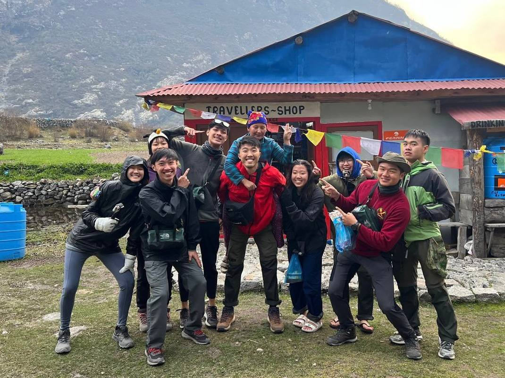

 

Took some cool shots along the way too. This is Alina, our exchanger from Germany. She looks and is every bit the mountaineer.

  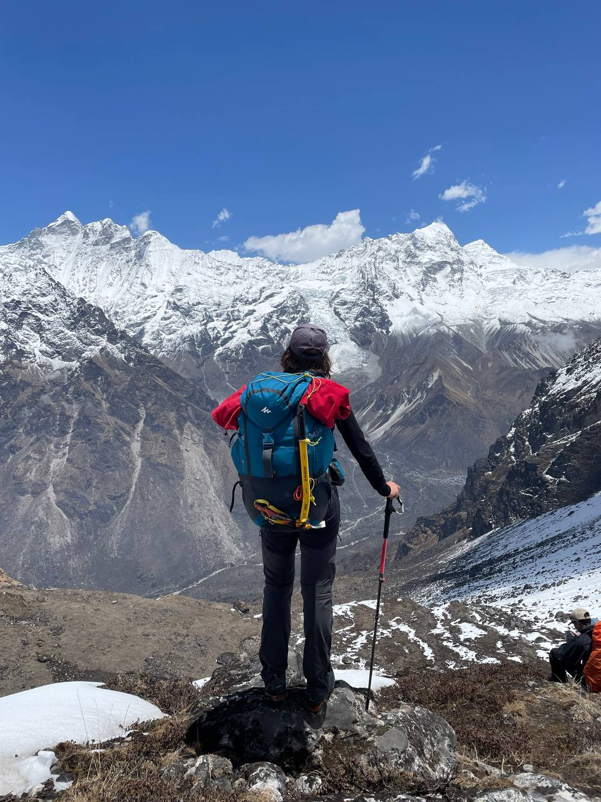

It wasn’t long before we reached base camp. Weather was great, spirits were high, and breakfast remained amazing. You could tell how much care our guides had put into planning every detail for us.

Though it wouldn’t be long before we learned why Baden Powell Scout Peak is only climbed in the summer. And that Mother Nature flexes her muscle whenever she wants, regardless of season.

    
Baden Powell or Tserko Peak

    
      NUS Mountaineering Club sends two batches of students to the Himalayas every year — the Summer and Winter teams. The Summer team typically heads for Baden Powell Scout Peak, famously first ascended by the founder of the Boy Scouts. The Winter team goes instead to a slightly less well-known peak in the south called Tserko Peak.
        
      The reason for this is simple. It is suicidal to scale Baden Powell during the Winter.
    

  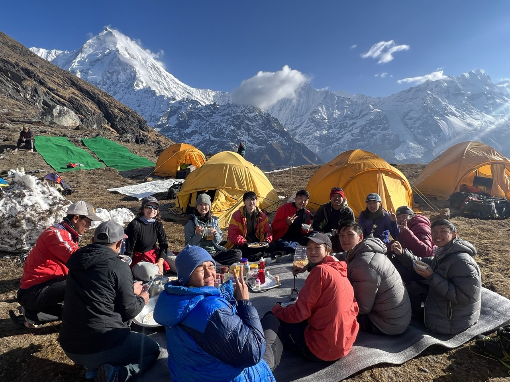

 

## Snowy Fields
The first snow hit, and it hit hard. Soon the ground was blanketed in a thick layer of white. The Summer team usually enjoys gentle weather and clear visibility during the day, but nights can be brutal with blizzards that sometimes bleed into the morning.

But for now, things were still smooth-sailing.

For now.

  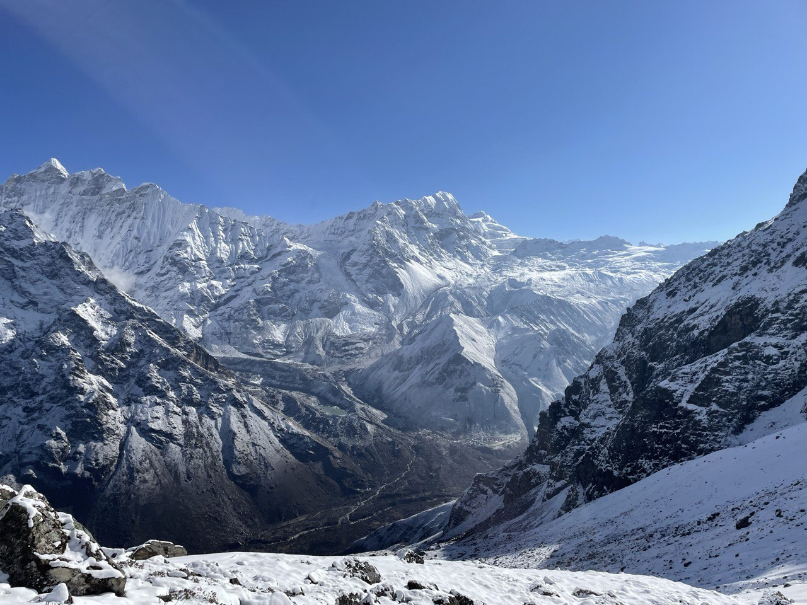

We woke each morning to a stunning view. Brushing your teeth while staring into a vast expanse of peaks was oddly calming. It makes you pensive, yet small. It's like you’re staring at a world that is far older and wiser than you. It has endured long before we arrived, and will continue long after.

There wasn’t much entertainment besides the snow, so we made full use of it. Rolling in it, throwing snowballs at the guides and helpers, building the largest snowman we could manage, and occasionally rolling giant ice boulders just because we could. Simple fun.

  <figure style="margin: 0; text-align: center; flex: 1;">
    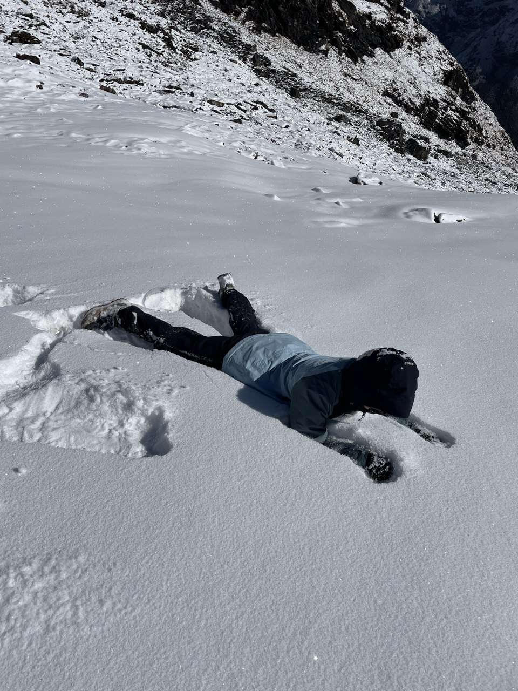
    <figcaption><em>Kimberly in her snowy habitat.</em></figcaption>
  </figure>
  <figure style="margin: 0; text-align: center; flex: 1;">
    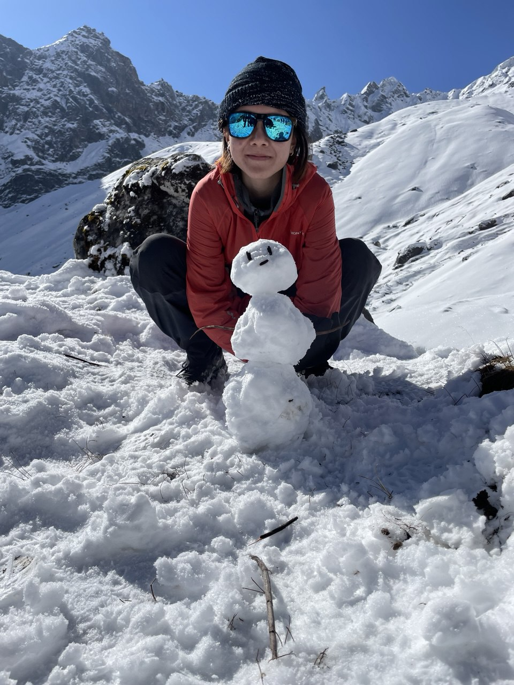
    <figcaption><em>Here's a mini one Jing Xuan made herself.</em></figcaption>
  </figure>

 

## Harsh Cold
Soon, it was time to head to the Advance Base Camp (ABC). And mother nature decided to hurl some blizzards our way. It got cold. And dark.

  

Then colder, and darker.

  

We had no time to rest upon reaching ABC. We were racing against the storm. The snow was far too thick to pitch tents, so we took out our pickaxes and began mining away the rocks and ice at 5,000m above sea level.

Below is a perfect depiction of most of us after setting up just the first tent.

  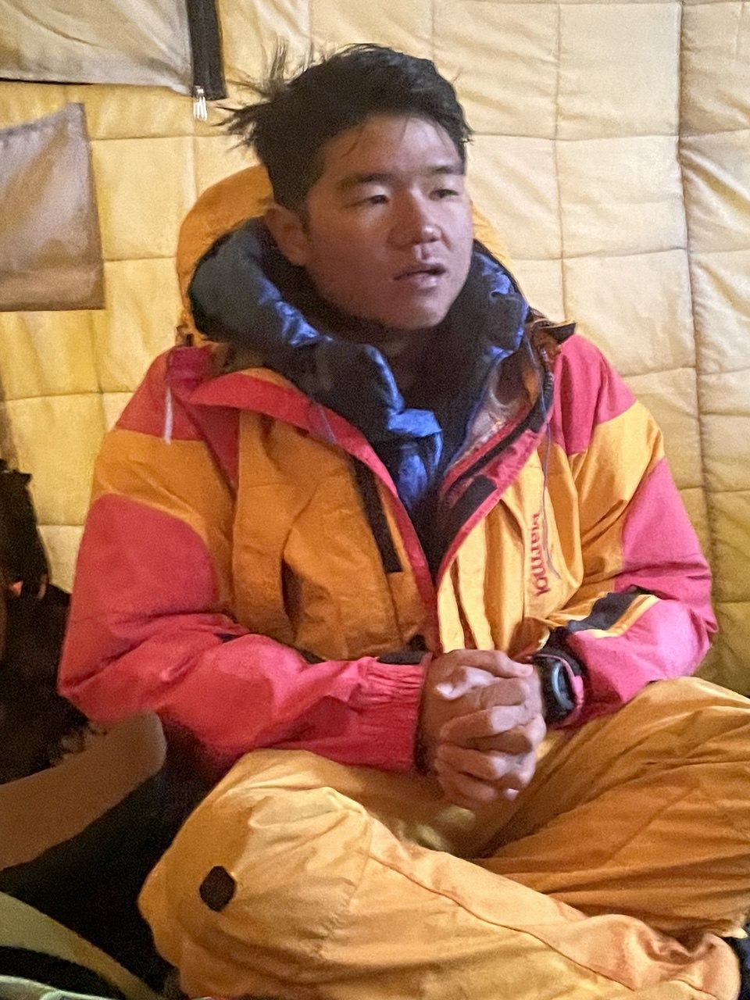

Even Kimberly, the doe-eyed bubbly girl, had lost most of her shine.

  

We even had to pull out an emergency blanket for one of our teammates who shivered uncontrollably, and wrapped her up like the Dalai Lama. _Scary_.

    
We might however.. have done more harm than good.

    
      It was only long after the trip that we realized we wrapped the emergency blanket the wrong way. The insulating layer outside instead of inside. lol.
        
      But hey, she's well and alive now so all's good!
    

 
Man, it was really, really cold. But it brought us together. Kenn is a warm bear indeed.

  

 

## Training
Some days, we lucked out and the blizzard stopped before sunrise. The skies cleared, and we squeezed in whatever training we could before the next wave hit. The thickened snow and ice gave us opportunities we wouldn’t have had otherwise.

Here's Calvin and Teng Chung building a pretty solid ice anchor.

  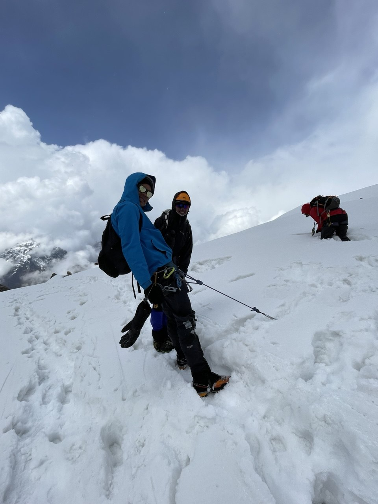

Here's me learning to ice climb with ice axes.

  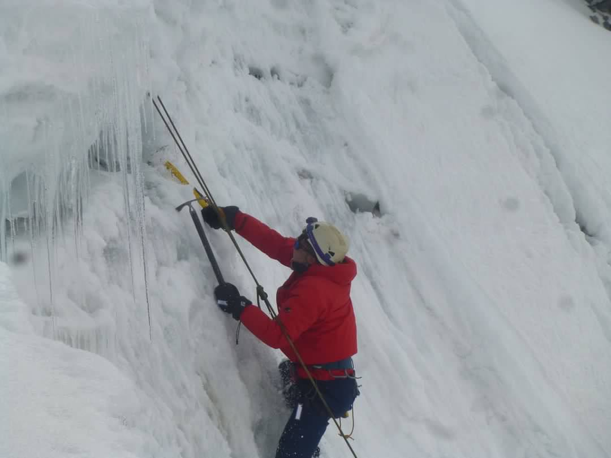

Though some of us were hanging onto dear life.

  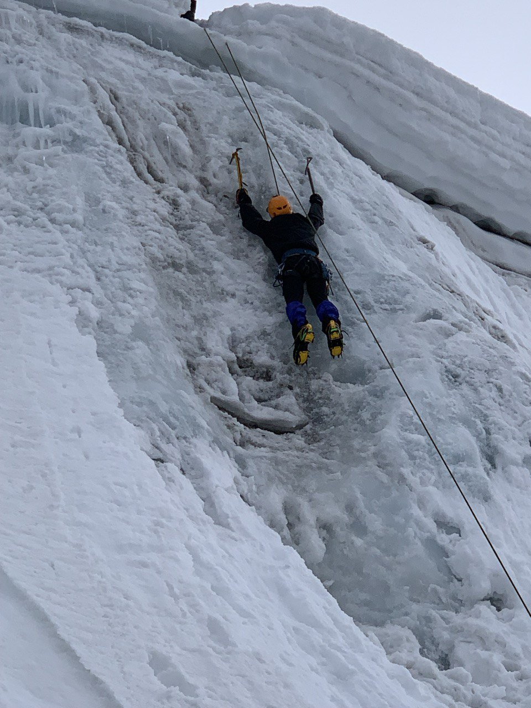

 

## Lovely Team
This is probably one of my favourite pictures of the trip, just us wandering across the vast expanse.  
Bonus if you can guess which one I am!

  

I should take this opportunity to briefly introduce my fellow mountaineers. These are friends that will probably (and I do hope) last a lifetime:
1. Aidan — A proficient climber and a fellow anime fan. We share some J-pop tastes, though overall I hope we could've been closer. It’s unfortunate he had to leave for the States so soon.  
2. Alina — She loves the mountains and now regularly visits the Alps since returning to Switzerland for studies. We still text occasionally, and I always enjoy the stories and pictures she shares. If I ever visit the Alps, which I plan to, I’d love to have her as my guide.  
3. Calvin — The “kid” of our bunch; our resident optimist. His alter-ego “Kevin” appears every night after 8:30pm sharp. By day he chats with anyone and everyone, by night the chatter turns into endearing babbling that leaves us confused half the time.  
4. Davian — The gadgets guy. The resourceful one. The chill dude. He is known by many things. I always enjoy conversations with him. We talked about his side-hustles, experiments, gadgets geek talk, and how his ideal holiday involves lounging on a beach in a summer shirt.. which makes him question why on earth he’s shivering high up in the mountains with us.  
5. Evie — She is perhaps the one i'm closest with in our Summer team. Not romantically, but we’ve been through a fair bit together. We somehow keep ending up in each other’s company. Probably because we live nearby. Along with Wen Wu (who also lives nearby), the three of us are forming an endearing friendship, despite our many differences, built on honesty and the willingness to call each other's bullshit in delulu times.  
6. Jing Xuan — Quiet and reserved, but always thoughtful and observant. She notices things most people miss, and I value her insights deeply. She has empathy and cares for others in the same gentle way Kenn and Sarah do, but in her own quieter fashion. I’ve learned she hides many things; I hope she’ll one day feel comfortable opening up and leaning on us too.  
7. Kenn — My fellow buffet devourer. A glutton at heart but such enjoyable company. He'll bring you to the best food places and and make sure everyone is taken care of. Despite his cheerful nature, he’s surprisingly reflective and some of our conversations ended up unexpectedly pensive.  
8. Kimberly — The doe-eyed bubbly girl who reminds me of a younger sister. Cheeky, vibrant, cheerful and never hesitant to use her charms. I like how self-aware she is, and how she goes about rummaging through life with spirited ease. Though you might not want to be the subject of her gossiping!  
9. Sarah — A kind, genuine, (lovably) nosy, and caring friend. She knows she can be clumsy and often ends up at the laughing end, but she’s always a good sport, often joining in the laughter. She may be shy, but she doesn’t hesitate to voice her thoughts when she feels something amiss. Sometimes she might tell me privately, perhaps hoping I'd say something on her behalf. I appreciate the trust.  
10. Teng Chung — Someone I consider a good friend, and I truly hope the feeling is mutual. Though I can't help but sense a barrier between us. We have our differences, and perhaps he doesn't like my gut. More than once he's rejected my hand, though maybe I was over-stepping boundaries. Regardless, I sincerely respect his drive, ambition, and discipline in Mountaineering.

When the skies cleared, the views were mesmerizing. The sun oozed golden light through the snowy arête, painting everything in a soft glow.

  

 

## The Push
The fateful day finally arrived. The culmination of months of training. We started early, around 2 a.m. Snow boots on, wrapped like dumplings, we pushed forward through hail and biting wind.

Soon, the risk of crevices became our biggest threat, and so we roped-up. We were so high up above the clouds the sky was a deep navy blue. Hauntingly clear.

  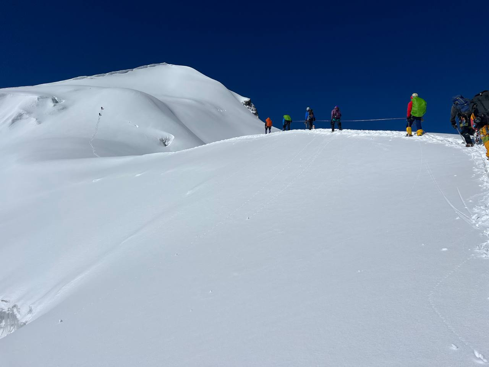

It wasn't easy. The snow was thick and at times, we took one step up only to slide two steps back. Though i'm sure no one had it worse than Kenn. 

  

Still, we were so close to the summit. And found it within ourselves to smile through it.

  

 

## The Summit

  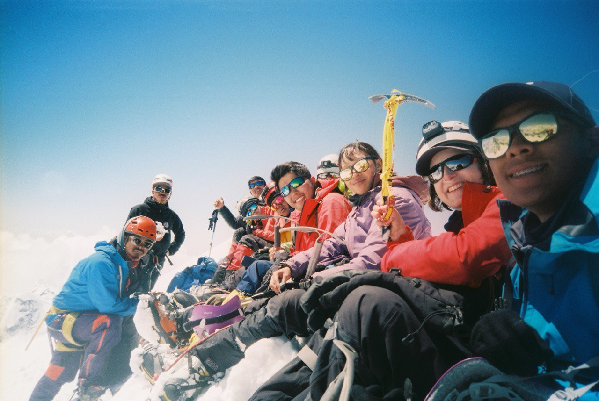

It was strangely underwhelming. It was just.. **a rock**. But i'm not sure what I was expecting either. I guess some part of me, the part raised on Pokémon games, secretly hoped that reaching the summit would trigger a cutscene or maybe unlock something within.

But this is reality. Just a rock and a view that doesn't seem too different from what I’d already seen on the way up. Still, no reason to sully the mood. A summit is a summit, and we were definitely going to take photos.

I recalled having to video Alina solve a Rubik's cube so she could flex on her boyfriend (his timing apparently qualifies him for internationals!).

  

Also, the guides were so high-spirited (probably counting their blessings no one died) that it was infectious.

  

 

# Descent
We crashed hard after the summit, a well-deserved rest. I never thought “lip-burnt” was a real condition, but apparently it is and every bite was excruciating. Salt hit my lips like betrayal. I also lost a couple of toenails and limped the entire way down the mountain. Otherwise, the descent was relatively uneventful.

One of the nights, we even ended up dancing with the guides, singing local songs, and just basking in the moment. I don’t have many photos from that night, but I do have several videos.  
All chaotic, all wholesome.

  

 

I also made friends with a Nepali gem collector and had a great time bantering with him.   _I think_ I avoided being overcharged, but Aidan who paid $25SGD for a rock definitely did not.

  

The trip ended with a farewell dinner at a nice restaurant. Well, as nice as anything can be after being 21 days away from the city. Courtesy of Mr. Tulsi, our lead guide.

  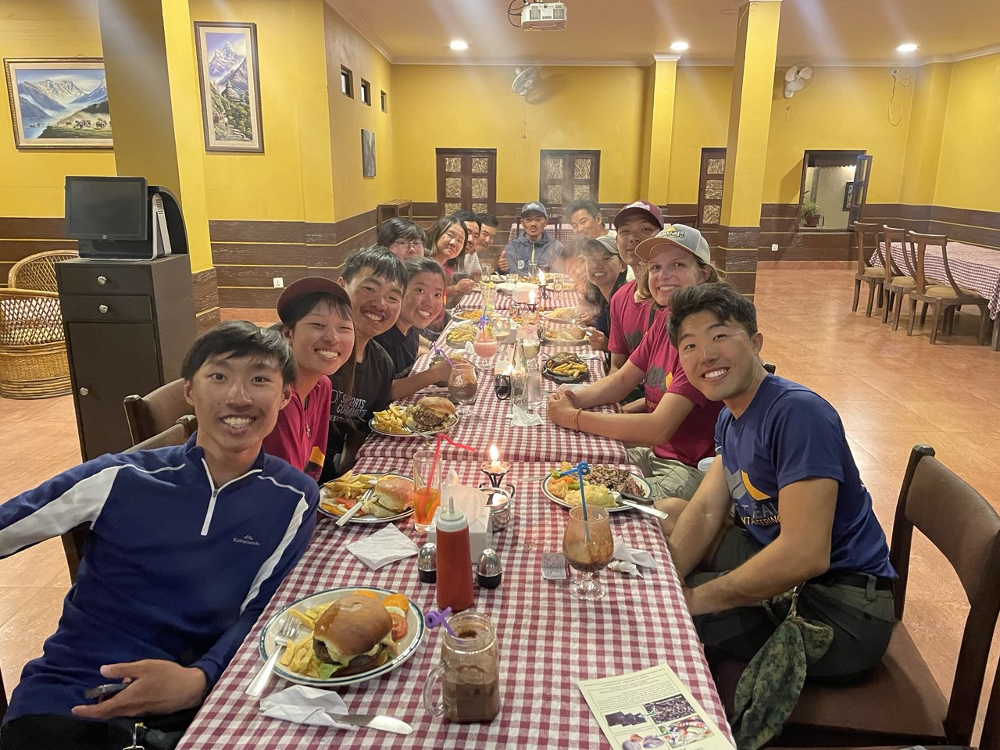

Here's my haul for the trip. And a warning.

  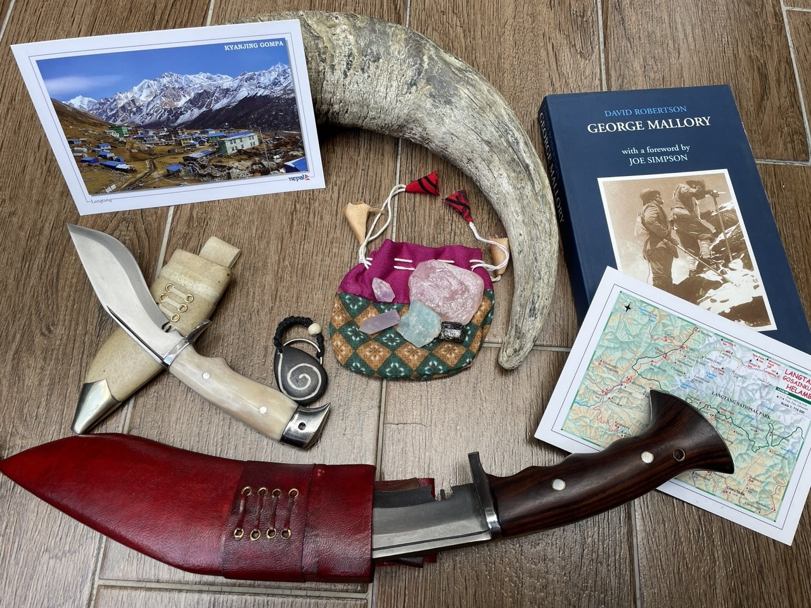

    
My Toes

    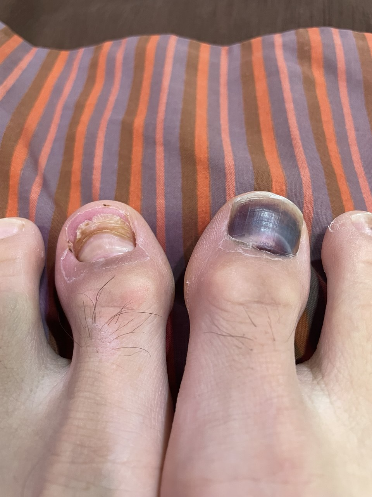

 

Somehow managed to smuggle back a Yak's horn, which has since become NUS Mountaineering Club's treasure.

 

# Thoughts
The trip wasn’t without tense moments. A month in close proximity with anyone, much less a group, is enough to ruffle feathers. 

There were factors beyond our control too. The day before reaching ABC, our guides warned us that the snow might be too thick to safely summit. They suggested turning back or attempting a different peak. Some of us were showing signs of weariness. Still, we held a vote. The tie-breaker fell to me.

We forged ahead, which explains why we ended up mining snow at 5,300m, but it was the first time I saw the disparity and fractures in our mountaineering spirit.

At night, in the quiet, I found myself wrestling with things i had shoved aside for months. **What did I want in life? What was I optimizing for?** Some mornings, staring at the peaks beyond — Shishapangma, Everest, Lhotse — I wondered if a nomadic life of adventure was what I wanted. But by evening, I was anxious about losing all I had built in the virtual world: skills, routine, momentum.

**I worried about trivialities.** I worried about not solving LeetCode problems. Not passing interviews. Not learning fast enough. Falling behind my nerdy friends. I wanted too many things, and we know those who chase 2 rabbits often end up with neither.

The thought of not letting go of work brought back other memories. I had been a wreck who stubbornly clung onto an old flame. **I met the most amazing girl yet I did not hold her tightly enough** in my pursuit of studies and work. Soon, I found myself partially obsessed with self-inflicted punishment as atonement and intentionally maintained my distance with any romantic prospects.

Maybe I needed to change, maybe mountaineering could shine the path forward.

Or was I just running away and refusing to admit my own inadequacies. How is it that I had done so much, prepared so thoroughly, yet still struggled to find an internship?  
**_Madness_**.

Perhaps my deepest regret of the trip is taking it out on a close friend. I recall in the final inn before the push to the summit, we were gathered around the fire, and somehow the conversation drifted to Christianity. As someone who struggles with faith but has read more than the average, I was eager to share my stance. Perhaps a little too eager, pouncing like a predator that finally spotted prey. It wasn't so much of a discussion as it was me layering argument over argument, cornering her. In hindsight, it was not in good faith. I did not enter that discussion with an open mind. I went in to inflate my ego, to feel victorious, and re-assure myself that I still had authority over something. **Looking back, I did her wrong.**

Fortunately, she had the heart to look past my moment of folly, and we remain close friends to this day.

 

# New Adventures
The trip was inspiring, but it also left me brooding more deeply about life. Still, it did change one thing with certainty. It awakened a desire to travel far and wide, to explore both the world and the quieter corners within myself.

This jourey became the catalyst for many more backpacking trips and impulsive adventures in the months that followed. Each one sharpened my self-awareness, showing me what I feared, what I valued, what I wanted to run toward, and what I had been running from.

And perhaps, somewhere between the mountains, the cold, the seabed, the soft boat rides into the sunset, and all those random stretches of silence, I finally learned how to listen to myself a little better.

    
    <em>Somewhere in Norway.</em>

