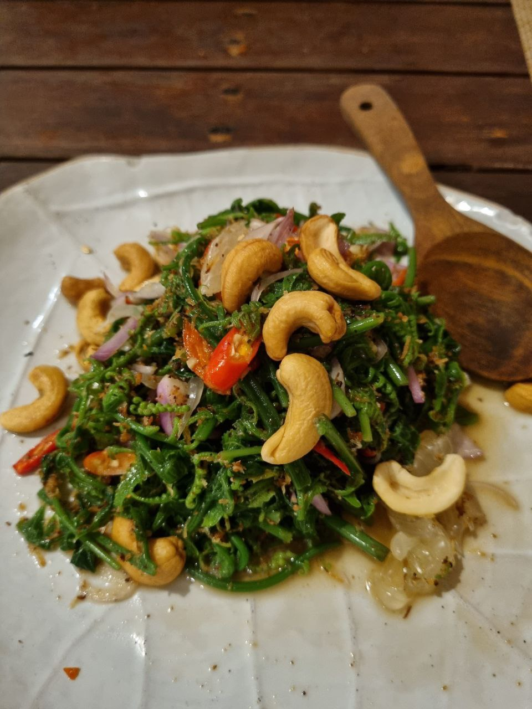
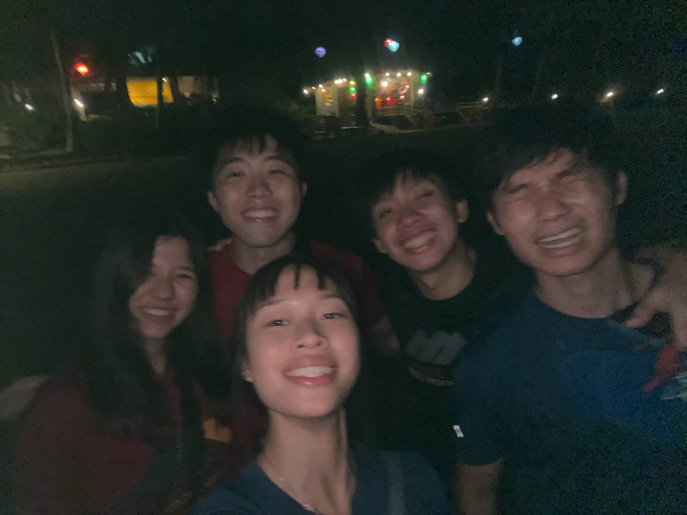
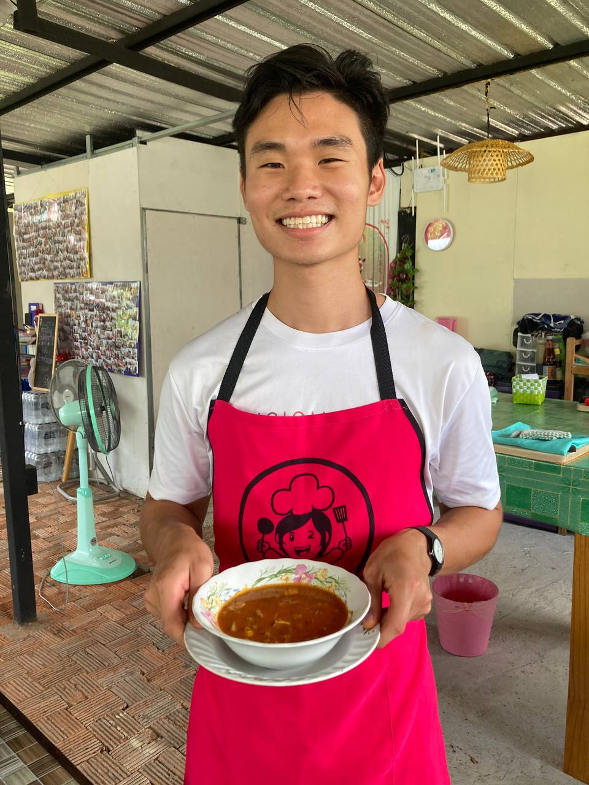
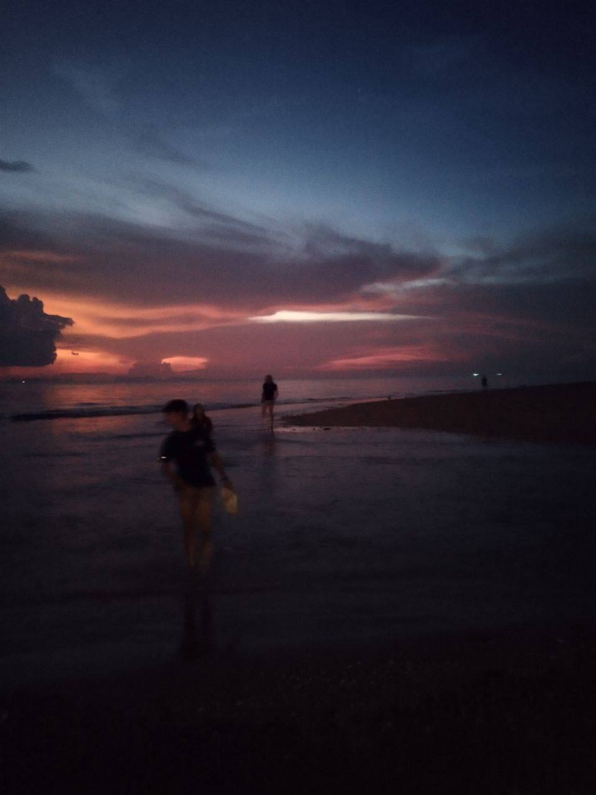

I'm travelling around Norway and currently on board sailing the arctic sea. This journey has been nothing short of marvelous - food, people, sights, all in equal measure. But these experiences deserve their own detailed recounting another time. Today's piece is about a memorable trip that left me yearning for more, the catalyst for many adventures in the Nordic regions and beyond.

# Krabi, Thailand
## An Impromptu Dive Trip
It was around early March when during one of the training sessions, the club's president, Ryan Jansen, asked me if I would like to join him in exploring Krabi's dive sites. He's an intriguing character to say the least. Somewhat of a ladies' man, though opinions vary wildly depending on who you ask. If his charm doesn't work, his lobster risotto will. Our mountaineering club tends to attract these sort of adventurous souls.  And i'm not much different - _young and dumb_, so why not?

The only hitch I anticipated was the tight schedule; I would be heading to Krabi just 2 days after exams and would be back just 2 days before my month-long trip in Nepal. Interestingly, I wasn't alone in this mad rush, a fellow teammate set to join the Himalayan trip was just as spontaneously silly.

## Wonderful Food

  <em>"Eh Andre, damn.. it looks good. Should I just have some Green Curry Crab? It's not a vegan dish though.."</em>
   
  <em>"Eh Andre.."</em>
   
  <em>"Eh Andre.."</em>
   
  <em>"Actually, I realised, crabs aren't technically meat. They are kinda like insects of the sea y'know."</em>
   

  - Wang Rizhao

 

Food there was amazing and fairly affordable. Dishes like fried rice, Tom Yum were a constant presence at every dinner's table. But my god, it was the Thai-fried omelettes that never fail to impress. That perfect blend of crispiness and tenderness was irresistible, and indeed, I ordered one after another. My love for eggs became a well-known fact among the restuarant staff at every meal.

I also recalled an interesting encounter with the waiters on one of the nights. We had travelled a long way and finally reached [Ruen Mai restaurant](https://www.tripadvisor.com.sg/Restaurant_Review-g297927-d7297906-Reviews-Ruenmai_Krabi-Krabi_Town_Krabi_Province.html) (Strongly recommended if you're nearby!). Famished, we quickly ordered a myriad of dishes and it wasn't long before the table big enough for perhaps 8-9 but sitting the 5 of us, were fully filled. We overheard the staff giggling and one even sheepishly questioned if we could finish.

    

Imagine the shock on their faces the second time they had to return with the menu 🙃

Not many pictures of food, so here's one at a restaurant. Dinner on most nights was by the sea side.

## Wonderful Friends
This journey was more than just about the thrills of diving and the delight of Thai cuisine. It was a trip where we discovered new facets of each other's personalities, our outlook on life, and motivations to continue mountaineering.

Then there's Rizhao, who went from being an ordinary acquaintance, to a close friend I occasionally seek advice from. He's 1 year my senior, studying Computer Science as well, but with a world of experience. You can find him [here]() (**EDIT:** It's no longer up.. Read on to find out why!) where he detailed his very interesting life encounters. 

We've had long, drawn-out conversations, particularly the night when Ko Lanta faced an island-wide power outage. He told me all sorts of stories, some he's shared online, and others you'd think he'd keep to himself, especially not with someone whom he'd only just met. I really valued the trust he showed in me, and listened attentively to all he had to share. 

## A Look Into the Life of a Fascinating Youth
### The Trailblazer
Young Rizhao in highschool showed signs of being a _trailblazer_, with a knack for innovation. And that meant he often found himself at odds with the school authorities.

    
Mama Shop

    
        A convenience store or sundry shop in Singapore.
    

He launched his own mama shop, cleverly sourcing snacks in bulk from Malaysia at low prices and selling them to his fellow students at a profit. It didn't take long for the school's shop owners to realise something was amiss and reported it to the school authorities. 

Bored, he wandered the school grounds and found an abandoned shed in a deserted corner. Over the next few weeks, he transformed it into a gaming room, outfitting it with a TV, PlayStations, and anything else he could obtain. It quickly got popular and just as quickly, got himself busted again. He didn't seem to care much though (he claims); it seemed the thrill of building the shed was enough for him.

A romantic at heart, Rizhao would write poems and pursue love with fervor. It was delightfully medieval, though his efforts met with little success. He even tried to launch a company at the tender age of 16.

Truly an eccentric individual determined to live vibrantly.

### The Rebel In Army
Next came the _rebel_ in the army.

Never one to tread the conventional route, it was not surprising he would land himself into trouble in a place where regimentation and discipline takes precedence. Some of his stunts were.. pretty out there (nearly landing him in military prison 😮). He didn't commit any heinous crimes of course; it's just that he does not conform to authority well. 

I suppose most of his penalties stemmed from standing up for what he believed was right. He is an idealist; and a highly capable one.  
And they can be quite stubborn after all.

    
China

    
        I should add his parents (at least one of them, can't quite recall) was originally from mainland China. So their family might have some relatives or connections there. Or not. Maybe he was just YOLO-ing.
    

In one particular incident, with escape from the army never far from his mind, his series of 'experiments' - as he dubbed them - unexpectedly landed him in Beijing. He brought nothing, except whatever cash he had on him and his phone. But thought to himself that he would never return to Singapore. He wanted to start anew elsewhere. 

With tears in his eyes, he informed his parents. His concerned father flew over immediately. He hugged his son and told him it's fine if he wishes to leave permanently. That was much needed solace for Rizhao, and he broke into tears. His father intended to return the next day, and left some cash with Rizhao the night before. But when dawn broke, he managed to goad his son onto the flight back to Singapore.  
It seems he understands how to deal with his troubled son well.

Many of us goody-2-shoes, law-abiding normies would label him as a madman, though might secretly harbour some feelings of admiration. Despite his unconventional approach, or maybe because of it, he gained newfound respect from his peers back in camp.

### The Hustle Goes on

    
Fun Fact

    
        He picked up coding and web dev as a tool to build the tuition agency!
    

Rizhao's entrepreneurial drive didn't wane; he picked up coding and launched his own ventures. He was the brains (and programmer!) behind Astar Tutors, and here's a little-known fact: he recently co-founded [Sotravel](https://www.sotravel.com/), a rising star in the social travel industry.

Amidst the hustle, he revealed he felt lost. Without a clear purpose and periodically found himself tearful at a nearby park bench. So, he turned to writing.

His early days of university were a time of intense grind. It was during the peak of Covid and he shared he had minimal social interaction (online as well). He would study from dawn till dusk, further honing his proficiency. But this wasn't sustainable and he soon found himself yearning for more.  
**For what, he didn't know.**

### Live, Love, Tears
Soon, he went for exchange abroad in Europe. He said it felt liberating, and for the first time in a while, he was excited about the future. And this was partly because of a girl. They were part of the same group on exchange. 

They were close. Really close. He was head over heels for her. And she spent most of her waking hours with him. With less than two months left, he mustered the courage to pour his heart out. He handcrafted a variety of gifts - poems, cards, picture montages, and even flowers.  
Yet, when the big day came, his feelings were unreciprocated. 

He underwent a whirlpool of emotions. Felt lost yet again. And on the spur of the moment, he mailed most of his baggage back to Singapore, bought a flight ticket, and forsaked whatever travel arrangements he had with the others in the last month.

Having only the equivalent of 80SGD in his pocket, he wandered the heartlands of Europe, by foot and train, and occasionally working for accommodation — all while nursing a shattered heart.

How Was The Money Spent?

    
        Travelling and living like a nomad. Still, that's barely enough. 
        Nearly half of which he blew on deep water solo (pretty much climbing up then jumping into the sea). But it was during or nearing winter and the water was too cold. So he bailed. lol.    
        So, how did he travel far and wide across Europe? I don't know too :P  
        But here's a fun fact: Some trains don't check for a boarding pass until you're on it and the train has set off. They'll kick you out at the next station of course.  
        But who's stopping you from boarding the next one? Now, i'm not saying he did it, just some trivia.
    

    
An Interesting Encounter

    
        During his travels, he encountered two other broken souls on a bus (which, surprise surprise, he did not know headed where..). One was a young woman in her 20s who had once worked at a prestigious bank in the States but was now on a healing journey after a dreadful incident with a male superior. The other was an old man, either widowed or abandoned by his wife — I can't quite recall — who had broken bones from years of working as a saturation diver under the sea. Rizhao felt his grief paled in comparison to theirs, but the three of them bonded over their shared sense of loneliness and ended up sharing drinks at a bar. 
         
         
        I suppose you'll often find solace among fellow solo travelers. And I do enjoy similar fateful encounters in my own travels.
    

 

  <b><em>What a broken man. But what a lad.</em></b>

 

### At Peace, At Last
Fortunately, things turned for the better after his exchange. He landed himself at a reputable firm, committed further to climbing, eventually found a lovely girl, became a vegan (??), travelling around, and most importantly, he seems at peace now.

Oh, I suppose one thing that didn't fare well was his GPA. exchange abroad gave him a new perspective on life, and he felt school just wasn't worth his time. So, he took on a full-time internship while juggling other commitments on top of school. His GPA plummeted from well within First-Class to the depths of oblivion... but who cares? He landed his [dream job](https://stripe.com/en-sg/billing?gad_campaignid=22254888863&gad_source=1&gbraid=0AAAAADKNRO52MVwVTNPDyG-s6ZqT1eDES&gclid=Cj0KCQjw3aLHBhDTARIsAIRij58Sbx9rb3Sl7Nj0_7JoZvppKWKfVcHSFrvN1BXrWoWAk5Czoj2uGtEaAjtXEALw_wcB&utm_adposition=&utm_campaign=APAC_SG_EN_Search_Brand_Billing_EXA-PHR-22254888863&utm_content=733491423048&utm_device=c&utm_matchtype=e&utm_medium=cpc&utm_source=google&utm_term=stripe+billing+platform) anyway.

  <b>Andre</b>: <em>"Hey, how come you stopped writing about your encounters?"</em>
   
  <b>Rizhao</b>: <em>"Oh.. there's no need to. I'm no longer sad."</em>

 

    

## Somewhere, Beyond the Sea
Rizhao's life stories left me with a heavy heart. Already, the boat rides into the sunset, the breeze brushing face, the contemplative discussions, left me brooding over my own direction in life. As I looked out over the horizon on one of the many rides, a song I haven't played in awhile re-surfaced in my mind. I had a hearty time singing with the boys.

[Bobby Darin's _Beyond The Sea_](https://www.youtube.com/watch?v=Sq995BHejPU) would go on and live rent-free on loop in my head for the next few months. In joyous times, I'd sing along with it; on most days, just a hum. It tided me through tougher times and brought back fond memories of my experiences in Krabi and Nepal. 

Spotify informed I've replayed it 439 times since May. Proud fan.

## Getting Ready
The 5-day trip was extraordinary, but as dusk set in, it was time to return. I came, slightly apprehensive, worried squeezing in this trip might be a mistake. Yet, I left with much to ponder. Though back then, I haven't had the time to fully reflect on these experiences. So, I carried them to Nepal instead.

