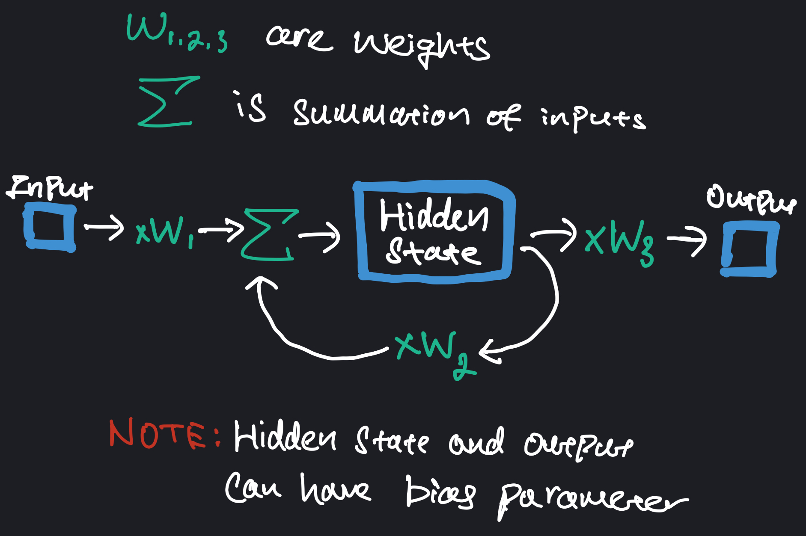
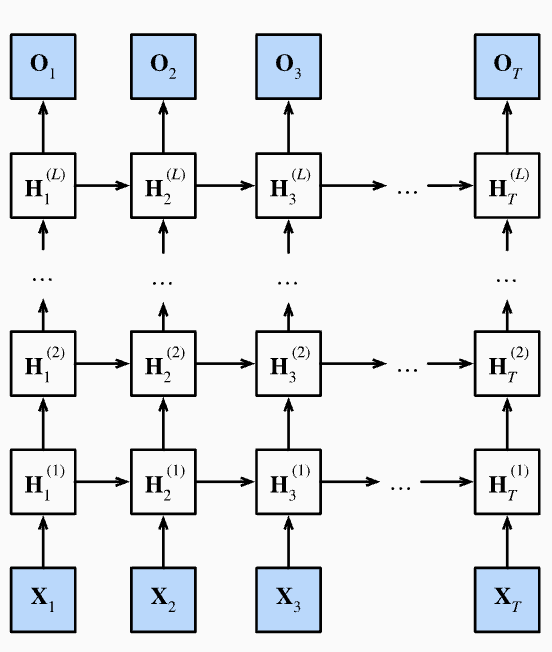
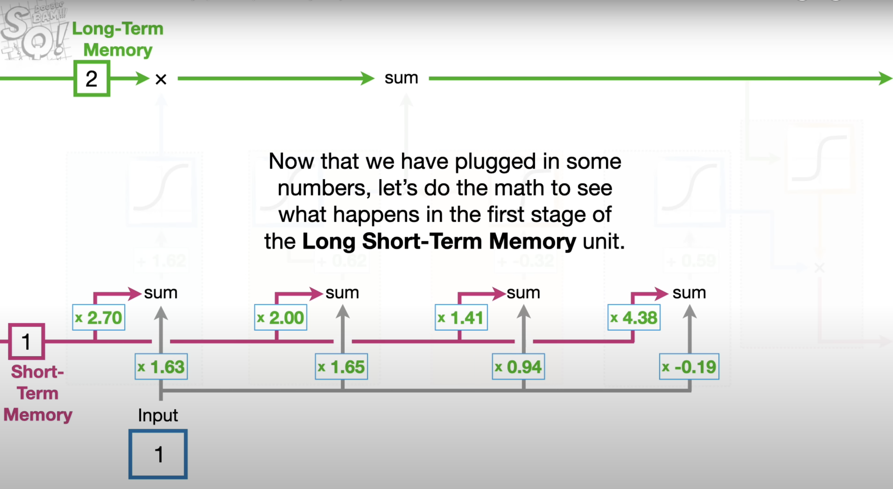
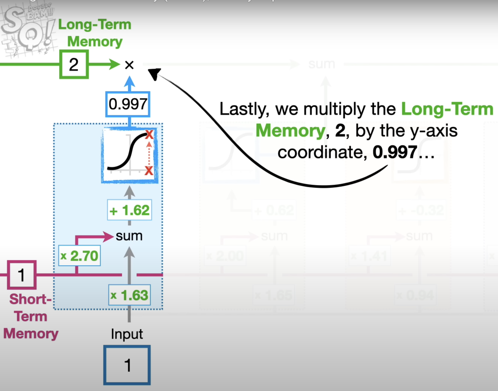
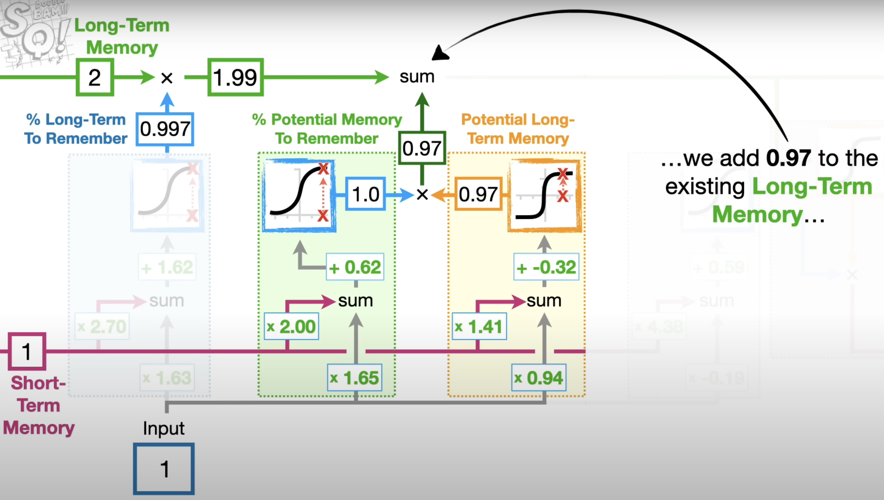
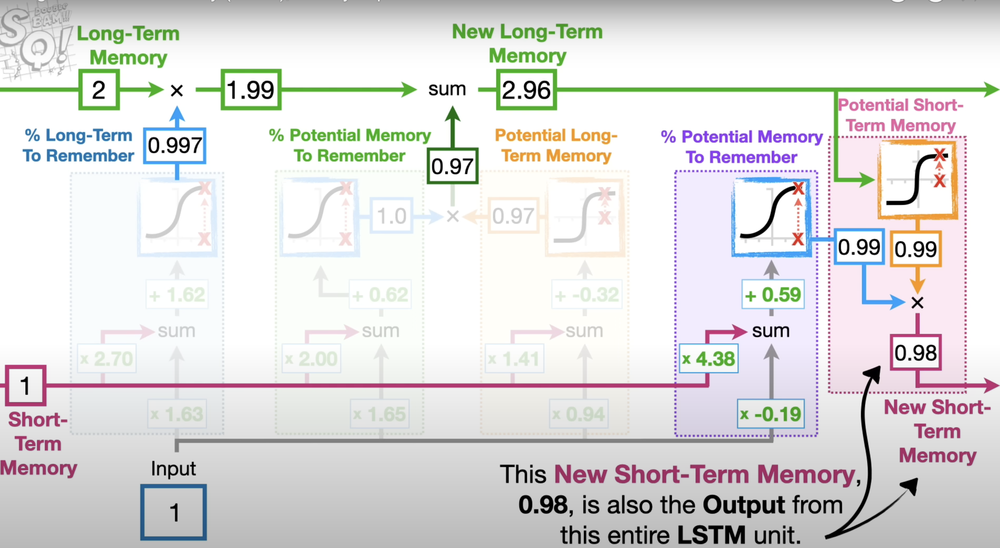

  
Edit: At the time of writing, Grant from 3Blue1Brown released a marvelous video offering a high-level intuition behind the transformer architecture.
   
  His videos are without a doubt, top-notch. But if you're more inclined for a short read than watch, this piece might just be for you.

-insert scary transformer pic-

## The Last Decade

    
Vanilla RNN

    
      RNNs were introduced to address the limitations of traditional ANNs (the standard feed-forward NNs) when it comes to processing sequential data. They do this by introducing a recurrent connection through a hidden state that allows information to flow from one time-step to the next. TThe hidden state maintains some form of internal memory, where the output of each step is fed back as an input to the next step. You can ituitively see how this captures temporal dependency - information from previous steps can be utilized in the prediction of the current step. 
        
      Below is an illustration of a single RNN unit.
      
      You might notice the recursive nature of RNN. Indeed, this is how information from previous steps are passed down. Here is a RNN unrolled twice. You can think of this as performing prediction (<i>y3</i>) by using data from previous 2 time steps. 
      
      The observant might find it strange that <i>y1</i> and <i>y2</i> isn't used in the prediction of the output. Indeed it isn't, but they still contribute to training through computation of loss.
        
      There are some things worth emphasizing:
      <ol>
        <li>The number of unrolling of the RNN is a hyperparameter that typically depends on your data and task</li>
         
        <li>Illustration suggests input is 1 dimensional. Naturally, you can have multiple dimensions in the input. But the weights become a matrix, similar to how they do in fully connected layer of an ANN</li>
         
        <li class='note'>RNNs are inherently limited in their ability to capture long-term dependencies (unable to well-utilize inputs from several timesteps before). And you can kind of see why from the unrolling.  
        Imagine unrolling 49 times to predict <i>y50</i>. Earlier inputs like <i>x1</i> still influence the output, albeit through <b>many repeated multiplication</b> with <i>w2</i>. The magnitude will be carried over to gradient computation, resulting in highly unstable training.</li>
         
        <li>I've drawn the illustration to only include 1 hidden state. In practice, you will likely have multiple more hidden states connected sequentially, and to other hidden states across time steps.</li>
         
        <li>Illustration below shows a multi-layer RNN architecture. Note that each hidden state can be influenced by other hidden states in the previous time step (even though the diagram doesn't seem to suggest it). So, we will have a weight matrix between hidden states. Which means the number of weights grows quadratically with the number of hidden states.</li>
      </ol>
      

          
          
<small>Image credit: d2l.ai</small>

      

    

Rcurrent Neural Networks (RNNs) were among the first architectures to process sequential data. And until 2017, RNNs remained as the primary neural network architecture, with Long Short-Term Memory (LSTM) units and Gated Recurrent Units (GRUs) - which can be thought of as a simpler version of LSTMs - being the most prominent and effective variants. In the present, LSTMs are becoming increasing obsolete, particularly in many areas of Natural Language Processing (NLP).

    
Applications for LSTMs

    
        Calling LSTMs 'obsolete' might be slightly too harsh. There remain use cases for LSTMs:
        <ul style=>
            <li><strong>Resource Constraints:</strong> LSTMs are more suitable for environments with limited computational resources, such as mobile devices, where the heavy resource demands of Transformers may not be feasible.</li>
            <li><strong>Real-time Processing:</strong> Ideal for applications where data is processed in real-time, such as streaming data. Inference speed of large transformer models may not be up to par.</li>
            <li><strong>Small Data Scenarios:</strong> LSTMs can perform well in cases where the available training data is relatively small or moderate.</li>
            <li><strong>Specific Types of Sequential Tasks:</strong> LSTMs are often used in the domain of time-series forecasting. Though recent adoption of transformers prove far more promising.</li>
        </ul>
    

    
Understanding the LSTM Unit

    
        Understanding LSTM isn't the main focus of this piece. But below outlines my brief intuition behind the LSTM unit. Most of the illustration below are screenshots from <a href="https://www.youtube.com/watch?v=YCzL96nL7j0&t=1116s">StatQuest</a>, because I think the diagrams are clear (<b>totally not because I got lazy!</b>).  
        In fact, what I am about to share might be a re-hash, but hey, at least this isn't a 20-minute long video :)
          
        Perhaps the first realization to have is that LSTM is motivated by the issues of exploding/vanishing gradient problem in vanilla RNN. And the key novelty here is the introduction of two separate paths - long-term and short-term memory. 
        

          
        

        <ul style=>
            <li><strong>Long-term (represented by the green line):</strong> It can be modified by multiplication and summation but notice that there aren't any weights that can modify it. <strong>This is how LSTM mitigates the issue that plagued vanilla RNN</strong> - the lack of weights allow past inputs to flow through a series of unrolled units <strong>without causing the gradient to explode or vanish</strong>.</li>
            <li><strong>Short-term (represented by the pink line):</strong> Short-term memories are directly connected to weights and biases. You might wonder why are there multiple entry-points, and this is where the 3 Gates of LSTM come into play.</li>
        </ul>
        The 3 gates are introduced separately below, but they should be seen as components of a single LSTM unit. Each gate has its own set of weights and biases. However, similar to an RNN, unrolling the LSTM involves using the <strong>same set of weights and biases</strong> across all time steps.
        <ol>
          <li><strong>The Forget Gate: </strong>This module determines the % of long-term memory to retain. It computes a weighted sum (e.g. with weights 2.7 and 1.63 in the diagram) of the short-term memory and input, then passes the result through a sigmoid activation. This is a common approach in ML for regulating information flow - using sigmoid whose output is <strong>constrained to be between 0 and 1</strong> to control the <strong>proportion of information that is kept</strong>.
            

              
            

          </li>
           
          <li><strong>The Input Gate: </strong>This module computes the candidate for long-term memory and determines the proportion of this candidate to be added to the running long-term memory.  
          The computation for the candidate long-term value is simiarly based on a weighted sum (e.g. with weights 1.41 and 0.94), but the activation function used here is TanH.  
          <strong>How to determine the proportion of the candidate value?</strong> We do the exact same method of taking weighted sums and sigmoid activation as we had done before. 
            

              
            

          </li>
           
          <li><strong>The Output Gate: </strong>This module generates the new short-term memory (aka hidden state in LSTM)  
          It first computes a candidate short-term memory (e.g. 0.99 in the diagram) by applying TanH activation to the long-term memory.  
          The proportion (e.g. also 0.99 in the diagram) of the candidate value to be used is computed similarly to the other gates. As a reminder, this process of determining the percentage of memory retention <strong>follows the same computational structure across all gates</strong>.
          

            
          

          </li>
        </ol>
        What we've discussed so far is just one LSTM unit. In practice, multiple LSTM units are chained together across time steps, similar to how multiple hidden states are used in an RNN. 
         
        Despite these gated mechanisms, <strong>LSTM can still suffer from vanishing (and exploding) gradient problem when dealing with very long sequences</strong>. Gradients can still diminished when passed through many layers of activation functions which constraints the output.
          
        <strong>Do you see why LSTM is referred to a variant of RNN?</strong>  
        Essentially, if you replace the hidden state in the vanilla RNN with the LSTM unit (and maintain a running long-term memory), you get an LSTM model!
    

  
But there is merit for aspiring machine learners to study (or grasp the idea) the evolution of architectures starting from RNNs. Understanding their limitations sheds light on the inspiration behind the subsequent development. RNNs sought to retain past information to influence subsequent outputs, making them suited for sequential tasks such as time series prediction. They were simplistic in their design, which made them popular but also inadequate. RNNs suffer significantly from the exploding and vanishing gradient problems, which severely limit their ability to capture long-term dependencies (see RNN section).

    
Exploding Gradient

    
      Exploding gradients occur when the gradients used to update the weights grow exponentially as they are propagated back through the network. This can lead to extremely large gradient values, causing numerical instability and resulting in the weights oscillating wildly (and possibly not converge).
    

    
Vanishing Gradient

    
      On the other hand, vanishing gradients occur when the gradients shrink exponentially during backpropagation. This leads to very small gradient values, causing the updates to the weights to be insignificant. The result is that the network struggles to learn due to insignificant updates to its weights.
    

  
LSTMs came into the picture and the key innovation in LSTMs that helps manage gradient issues is their gated architecture, better regulating the flow of information through the network. However, in practice, LSTM units are still chained in succession, and will struggle with extremely long sequences. Processing data sequentially (each step must wait for the previous step to complete) inherently limits the parallelization within the training process. And because it is uni-direcitonal (information only flows one way), it is perhaps not suited in capturing nuances in natural language due to its limited ability in gathering context from both past and future simultaneously. 

Thus, the advent of Transformers.

## The Transformer

  
<b>A Fundamental Appreciation</b>

    
      
Before going any further, it would be greatly beneficial to have acquired an understanding of the vanilla (dense) neural networks. Appreciate that ultimately, neural networks comprise of <b>just a bunch of weights and biases</b> (a more convoluted linear regression). These are trainable parameters encapsulated in what is commonly referred to as a 'black box' - takes in some input and (hopefully) churn the desired output. <b>The hope becomes tangible if the optimal values of weights of biases are found</b>. And how these values are set, depends on the training process.

      
Of course, there are likely more transformations involved, such as activation functions to introduce non-linearity and batch normalization for stability. You can think of these as fancy accessories that can be swapped among various kinds (e.g. we have the ReLU, Sigmoid, Tanh activtiton functions). And I suppose it does make some sense why they are desired, after all, if all we do is to linearly apply weights and biases, the accumulation of all operations ultimately remains linear no matter how many layers of weights and biases.  
      <b>What hope would we have that this could capture intricate relationships with no clear separation</b>?

      *-insert vanilla NN with activation fn-*
      
<b>Watch this <a href="https://www.youtube.com/watch?v=aircAruvnKk">series</a> by 3Blue1Brown on Deep Learning if you're foreign to all these</b>! Episodes 1-3 offer an enlightening and intuitive perspective of Deep Learning. Episode 4 goes through the calculus behind Gradient Descent, the technique behind the training phase, and might be slightly heavy. If you're math-averse (though frankly, it's the notation that confuses people rather than the underlying concepts), feel free to skip it. The first 3 episodes should sufficiently and satisfyingly equip you with a solid grasp.

      
A short aside on the term 'black box'. Not entirely a big fan of the term though I empathise its common usage. Indeed, the wall of numbers in the layers of a neural network can seem intimidating, and we have no robust intuitive explanation why the input magically transforms into the output. But the key insight is to realise that with a suitable loss function, we can, with Gradient Descent, guide the model to tune its weights and biases based on how similar it is to the desired output. <b>How do we know that Gradient Descent will correctly tune the weights?</b> 
       
      Well, this is where Mathematics enter. We can, mathematically show that <b>Gradient Descent always converges to some local minima</b>. Some people may lament that a local minimum isn't the global minimum. <b>But one should question, is the global minimum even desired..?</b> Recall that optimizing the objective function (used in training) does not always translate to the lowest cost in actual production / testing. More often than not, there exists a 'good enough' range of values for the weights to achieve satisfactory performance on the actual cost function. So perhaps, the local minimum found might just fall within this good region, and in some cases, might actually perform better on actual live data than with the weights found from the global minimum.

      *-insert objective fn vs cost fn-*
      
One last thing, most people confuse the relationship between Backpropagation and Gradient Descent. Gradient Descent leverages Backpropagation to efficiently compute derivatives (gradients) of the loss function with respect to each tunable weights in the network. Sure, you can opt for a different technique to compute gradients, but it likely won't be as efficient as Backpropagation (which only require 2 passes!).

    

  
The Transformer was introduced in the paper titled ["Attention Is All You Need"](https://arxiv.org/abs/1706.03762) by a team of researchers from Google Brain. This groundbreaking paper revolutionized the field of Natural Language Processing, giving rise to various Large Language Models (LLMs) with vast linguistic capabilities - powerful enough to convince some people that a dystopian era of sentient (lol..) robots is looming.

Our beloved ChatGPT too, leverages a variant of the original transformer architecture to answer at our beck and call, even silly questions.

  
Anyway, before we continue our exploration of the transformer architecture from bottom-up, i'd like to try to convince (if you aren't already) why it shouldn't be too surprising that an inanimate object can sound so much like a human:

  
    <i>The Gentlemen Bastards</i> is one of my favourite medieval-fantasy series. It incorporated humour well in the midst of chaos and danger. <i>The First Law</i> is also another series I greatly enjoyed. The grim fantasy setting and pragmatic characters were something I found oddly amusing. I chuckled at the heroism that often shattered to pieces, but the book also made me genuinely question whether it would be worth living in such a grim world. The authors have a way with words, they brought the characters to life and got me real hooked. But it's not as if they had actually walked into my study, sat next to me, and read their work aloud with strong passion and intensity to convey every intended nuance. <b>All I did was read a chunk of text</b>.
  

  
And turns out, the 2017 paper has cracked the code behind human speech. We can train models to chain the right words, with the right punctuation, the appropriate pauses, and whatnot, altogether to emulate human speech.

Let's explore how it does it :)

### Word Embeddings
Machines generally only handle numeric input. So, words must first be converted to some numeric form. A vector of numbers is a natural choice. One common method used in the past is to represent words through [one-hot encoding (OHE)](https://www.youtube.com/watch?v=G2iVj7WKDFk). Already, you can probably sense this isn't a good choice. For one, the length of the vector has to be the size of your vocabulary, which clearly does not scale well.

  
Why?

  
    Adding 1 more unique word to the vocabulary means adding 1 more dimension to the representation!
  

One-hot encoded vectors are extremely sparse (each word exists in its own dimension). And it doesn't quite capture semantic relationship between words that are 'closer' in meaning, for instance, male and female vs animal. 

Thus, the need for word embeddings. Word embeddings are still vectors of numbers, but now, distance between the vectors matter. <b>Think of these vectors as giving coordinates in some high dimensional space (albeit not as high as OHE) where words with similar meanings tend to be closer to each other in that space</b>. This might sound very intuitive and almost trivial, but you might be surprised to learn that it wasn't until the mid-2010s that word embeddings received widespread adoption.

The implication is that the model can now learn patterns or relationship among words apply it elsewhere. For instance, if the model learns the vector difference (helpful for visualisation, but god knows whether the model learns more fanciful operations instead) between the representations of _Man_ and _Woman_, it could apply and learn _King_ as to _Queen_.  
As another example, consider _Pasta_ as to _Italy_, and if I ask _Ramen_ as to _??_, you would most likely suggest _Japan_. This vector space representation is precisely what we desire to meaningfully capture the words.

  
How?

  
    
There are popular and powerful techniques such as Word2Vec and GloVe that can capture word embeddings very well. If you're mostly dealing with normal english (and probably other languages) vocabulary, existing pre-trained GloVe and Word2Vec models should already be highly effective. After all, we don't expect the English Dictionary to change too often.

    
If you're interested, Word2Vec employs a shallow neural network (SURPRISE SURPRISE..) architecture to learn word embeddings. GloVe obtained embeddings differently by calculating global co-occurrence matrix. Yes.. fancy terms, feel free to read up.

  

### Positional Encodings

### Tokenization
I've been casually assuming the model knows how to parse a sentence into individual words, and very naturally such that the individual 'words' align with the words in our english language vocabulary. This isn't always the case. A more appropriate terminology would be 'tokens'. A token could be a word or little pieces of words that are commonly used. This offers greater flexibility. For instance, the model might find it more helpful to have _'-ing'_ as a token rather than have to separately capture _'eating'_ and _'playing'_ on top of _'eat'_ and _'play'_.

In practice, we often use some popular tokenizer from a Library (e.g. NLTK) to parse the corpus of text. Embeddings are then computed from these tokens found. The collection of all tokens is your dictionary (aka vocabulary).

### The Secret Sauce: Pay Attention!

### Trusty-old Softmax

## Heart of the Transformer: Self-Attention

## Different Architectures

### Encoder-Decoder

### Encoder-Only

### Decoder-Only

## Heck, they are all the same!
