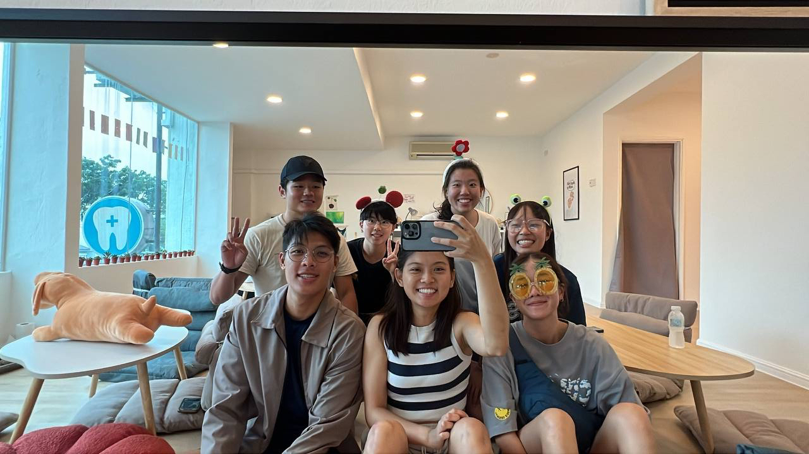

## Originality..?

So, i've finally come around to making my own site. Frankly, 'making' is giving me too much credit.. I didn't have to do much aside from customizing certain sections. Even the selection of the theme is inspired by a senior with a similar site. That said, I do like the simplicity of the design and the features it offers. I think it suits me. After all, front-end really isn't my forte and I doubt i'd make a good UI/UX designer. Anyway, the default site also comes with a blog. I pondered for awhile whether to have it removed but figured it isn't such a bad idea to leave it as a dumping ground for my thoguhts every now and then. So, here I am :).

## And So The Hustle Continues
I haven't yet mentioned what even spurred this on. But you might've guessed it. August is the time when most (big) firms begin their recruitment process. Every computing kid down the block is scrambling to beef up their resumes, color their portfolios and impress with dynamic sites. *𝘚𝘤𝘢𝘳𝘺*. 

Turns out, i'm no exception. It's difficult not to feel the pressure when everyone around is spending most of their waking hours in preparation while juggling a full term of coursework. I even bailed from an exciting diving and hiking trip at Dragon Horns in Tioman (Malaysia) with my fellow mountaineering friends :'(. I was the only one (save the exchanger) not to go, so yeah FOMO was strong. Still, I'm glad they are having a blast. It's unfortunate how much of a rat race this has become but let's leave that discussion to some other time.

Anyway, I was going about my own preparation (mostly LeetCode grind. **Disgusting - yes, I know**) when someone in my Computing cohort announced that he has compiled a list of firms, mostly top and possibly out-of-my-league ones, and has kindly decided to share with everyone else. Naturally, this is a great thing to do! And it saves me time having to look up pesky companies' careers pages whom tend to avoid LinkedIn or other job searching sites. But I glanced through the profile of interested applicants, a close friend's as well, and thought to myself *damn.. they've got some real solid portfolio and pretty sites*. It made me anxious. I thought about making a site from scratch too but felt my time could be better spent elsewhere, like writing now LOL. But seriously, I am quite certain I would be distracted midway and wind up reading some paper or whatnot in the name of learning.

So there we have it, 5am deep into the night (or morning wtv), just finished wrapping up with the site and leaving a short read for whoever that chances upon this site. Goodnight -.-
