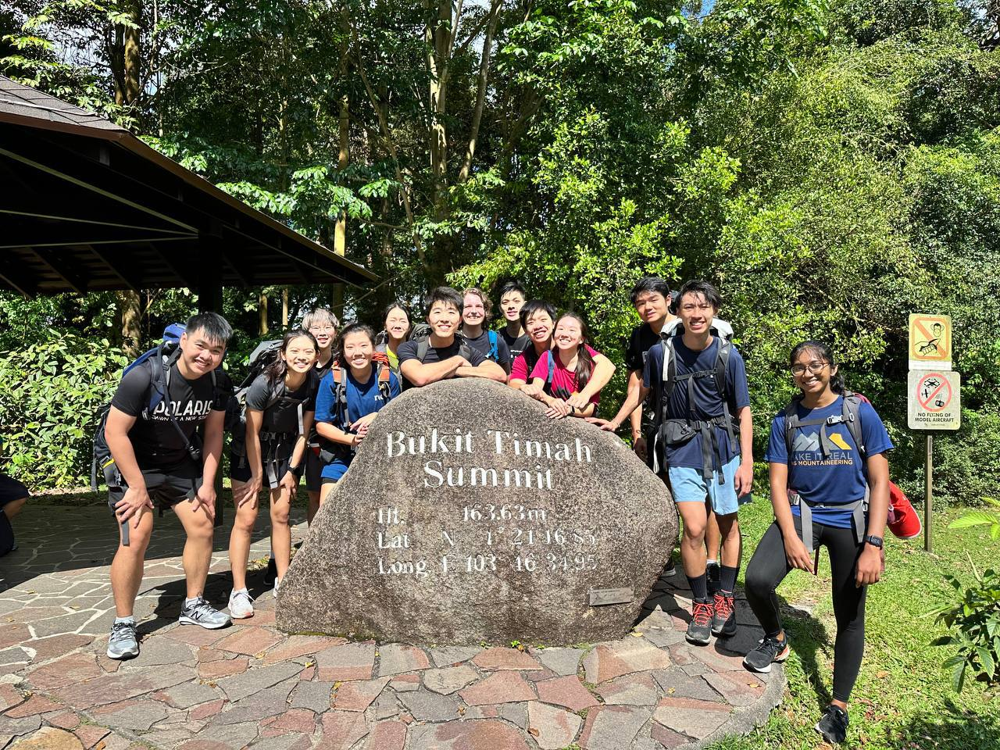
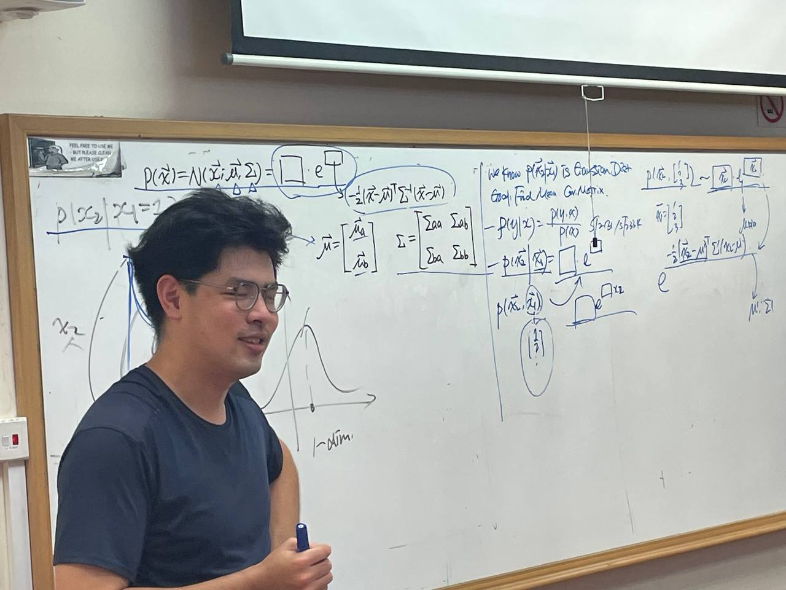
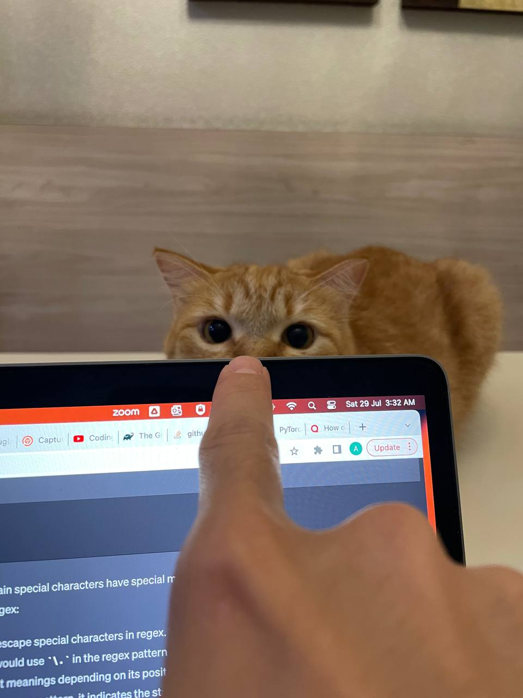

## I'm back
Vanished for a little while, but i'm glad Y3S1 is wrapping up. A much-needed winter break is ahead, though it's packed with activities. I'm returning to the army for a week, then off to Batu caves with a new bunch. But the highlight of the holidays is a 3-week long adventure in the Nordic lands. It's going to be a tight squeeze preparing for these trips.

## Growth Spurt
### 2022: A Year of Expansion
2022 was a tough year, I ventured into new territories and hopped from one place to another. Some relationships faded, regrettable, but new ones were forged too. Though it wasn't until a few months had gone by and high up in the Himalayas for me to lament the absence of old flames. But the path of learning has been incredible. I've gained so much knowledge and skills, and it feels like i'm accelerating and gaining more momentum with each passing day.

### 2023: Intense and Defining But A Ridiculous Timetable
In many ways, 2023 was even tougher, but brought alongside more defining moments. Frequent, intense trainings for my first ever mountaineering expedition in Nepal. Software intern by day and tragic mugger by night. Balancing academic load with teaching duties. Getting experience with research projects. Diving into higher-level exciting ML modules - a sobering yet reassuring realization that I'm just skimming the surface of an immense field. And then, the long nights of LeetCode and job preparation. Man, it felt like I absorbed more in the past 2-3 years of exponential progress than in the previous 20 years, a trajectory i'm eager to continue (at least, still keen on plunging head-first into treacherous waters).

## Mixed Emotions in the Pursuit
_Most days were fun but some nights were tougher than others_. 

### The Grind
The later half of the year saw me doubling down on my efforts in the internship hunt. I would retreat to my comfy quarters, play some lo-fi or city pop and grind leetcode questions. There is something strangely fun with just tackling these problem-solving questions. I suppose its because they are closed questions, an unequivocal answer exists, and this brought a peculiar comfort amidst the chaos.

Competition has become so much more intense. It isn't just sufficient to be all-round technically competent, now there's a whole emphasis on behavioural fit, diversity inclusion imbued into the many rounds of interview. Securing a spot among hundreds of applicants for just a few measly positions was daunting.  _How worrying_.

It is not to say that my efforts didn't yield any results. For one, my resume has caught more attention and I made it to several final rounds. Some of which are Quant firms that most CS majors would dream of. I figured I would eventually be filtered out (not quite yet ready to headbutt against our dear fellow IOI and IMO olympiad winners) but I wanted to see how far i'd get, and maybe scout a little for an all-out attempt in the near future. I was pleasantly surprised to learn I made it to the last rounds, and with it, inevitably built up hope, and naturally, eventual disappointment. Still, this means i'd stand a fairly good chance at decent firms a tier down, right?  _That's assuring_.

  
  <em>Dior sneaking up as I study</em>

### Relentless

Turns out, I was wrong, dead-ass wrong. Dozens more applications and a couple more interviews got me pretty much nowhere. I thought I at least performed well for some, given I was able to answer most of the technical questions. But I guess I might have fallen short in other aspects, or there indeed are plenty of equally qualified candidates with possibly more to offer. So there I was, **with plenty of small Ws but no one single concrete W**.  _How frustrating_.

I decided to expand my search globally. Since i'm facing troubles finding a local internship, might as well gun for overseas ones and take the opportunity to travel abroad. The thought excited me, travelling while working. _Finally, spreading my wings eh, heh_. So I began blasting out applications indiscriminately to anywhere and everywhere. I knew obtaining a work visa might be problematic but securing overseas internship isn't unheard of and so I figured, surely it would eventually work out right? Just focus on the technical aspect and light will naturally shine on the path.  _How naive_.

Somewhere along the way, school started becoming a little trickier. I know I signed-up for this but damn, some days I would just walk into class, sit down and wonder:  _Jeez Louis, what the heck are those symbols being written on the board. And how does he make it seem so simple. Da heck._

Don't get me wrong, Ming Yang is an excellent TA by the way. Aside from his thick accent, he's highly committed and well-equipped with knowledge and mathematical prowess.

Then the writings got even stranger.

_How distressing._

Fortunately, things got better and I gradually started to assimilate the content and derived great pleasure from understanding. _ML rocks!_ I soon found myself spending an excessive amount of time on my ML mods and less on other mods which on hindsight, probably isn't the academically-wisest choice for pulling CAP up. That said, I picked up more than the average student (will be finishing up the blog on LLMs!) and my grades for these modules were stellar. The others, well, they aren't bad, but probably could've done better.

My local internship hunt wasn't going too well and it was nearing the end of the semester. Overseas hunt sent me on a wild goose chase. Remember the Visa issue mentioned? Well, yeah that kinda came back biting me in the ass. Turns out, securing a visa internship outside the states was more problematic that I had imagined. Process is convoluted and most firms (less the well-known ones) naturally wouldn't know much about facilitating the visa process. TLDR, the ones that I had high hopes for, which coincidentally happened to be outside of the states, figured they can continue their lives fine without me.  _More frustration._

### Sometimes, the light at the end of a tunnel..

 is an oncoming train. 

 

Now, I am back at square one. It sure didn't help knowing that my dear friends are clutching internship offers. I trust they have put in plenty of due diligence as well, and i'm sure the offers they have gotten are well-extended.  Still, can't help but feel _Envy creeping in_.

More concerning, I started having doubts. Perhaps i'm doing it all wrong. Maybe I could have better focused my efforts on certain aspects. Maybe it was the way I carried myself. Maybe I failed to explain my concepts and ideas clearly enough. Maybe I just wasn't a good fit for the company. Maybe I could have choked less. Bunch of maybes, no idea where to start working on. But something has to change, and I will ponder more over the winter break.

### Not All Was Bad
2023 was also a re-defining year. **The seeds of change have been sowed**. I travelled a lot more this year, some with friends, some alone. Two trips really stood out, during which I found myself becoming increasingly introspective. From plunging into the beautiful depths of the sea to scaling the majestic heights of the Himalayas, I've done a fair bit of living. For once, I truly felt that there is so much more to life than academia and work. 

I've also had the opportunity to speak with several established mountaineers. And it's high-time to start pondering how serious of a mountaineer I wish to become, how high the peaks I would like to scale, how treacherous the climbs I wish to endeavour, and I guess, how selfish of a man I might become.

## Old Habits Die Hard
So I started the semester all ra-ra and ambitious. Found myself in a slump a couple of times along the way and questioning why the heck am I doing this to myself. Do I really need to pile on such a heavy academic load? Probably not, with the modules I have taken, I can opt for a pretty easy route with minimal load till Y4S2. And this would leave me more room in other ventures.  **Yet, the persistent thought that there's always more to learn lingers on.** 

This thirst for more knowledge isn't too surprising. After all, ML is a huge field encompassing various complex sub-disciplines. There's the mathematics and algorithms aspect. Then, there's the whole bulk with OS and parallelism to optimize training time. A good ML engineer would also need to have strong mastery over databases and managing data pipelines. And if we discuss real-time training and scaling resources, it is hard not to involve cloud computing. All these are deep, deep rabbit-holes. 

But I acknowledge I should not be biting off more than I can chew. I do feel burnt-out at times and I doubt that's any good health-wise nor conducive to learning. Knowledge retention is one other issue I am currently grappling with - somehow i'm forgetting quicker than I would like and concepts get mumbled-jumbled up in my head if I leave them alone for too long. An intentional effort to recap needs to be present and I suppose this calls for a break from another ridiculous semester.  _Or not lol._

Gonna roll the dice on this. You'll know what's up if I go on another hiatus.

  
  <em>Another picture of Dior because how can you possibly resist?</em>

